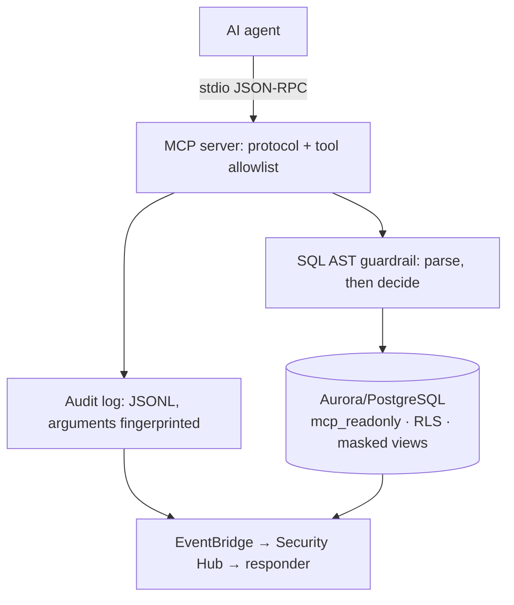

# secure-serverless-security-platform

[](https://github.com/Mpurushotham/secure-serverless-security-platform/actions/workflows/security-pipeline.yml)

**Securing AI agent access to regulated production data on AWS.**

An AI coding agent that can query production is a new class of principal: it holds
broad credentials, acts on instructions from text it reads, and is exactly as
trustworthy as the text it last processed. Most guidance treats this as a prompt
problem. It is an authorisation problem.

This repository takes one narrow, high-stakes case — an agent querying a pharmacy
database holding GDPR Article 9 health data — and builds the controls end to end,
with evidence rather than assertions.

---

## What is real vs. what is designed

Stated up front, because a repository that blurs this line is worse than one that
builds less.

| Component | Status | How to verify |
|---|---|---|
| MCP protocol core (JSON-RPC 2.0 over stdio, hand-written) | **Runs, 37 tests** | `make test` |
| PostgreSQL least-privilege baseline (roles, RLS, masked views) | **Runs against Postgres 17** | `make db-up && make evidence` |
| SQL guardrail (AST parse-then-execute) | **Runs, 37 attack payloads refused** | `make test` |
| Read-only RDS/Aurora MCP server | **Runs end to end** | `make mcp-demo` |
| PII leak assertions over the live transcript | **Runs, 27 assertions** | `make test` |
| Terraform: Aurora, Bedrock, agent IAM, 8 detections | **checkov 169/0** | `make validate` |
| CI/CD security gates (SAST, deps, secrets, IaC, SBOM) | **Runs** | `.github/workflows/security-pipeline.yml` |
| Threat model (STRIDE + attack tree) | **Written** | `docs/01-threat-model.md` |
| AI secure-coding policy + training framework | **Written** | `docs/04-ai-secure-coding-policy.md` |
| JD coverage matrix + day-one operating plan | **Written** | `readiness/` |
| AWS posture MCP server (GuardDuty/Security Hub/IAM/S3/KMS/Config) | **Runs, 12 moto tests** | `make test` |
| CDK reference app + enforcing Aspects | **Synths clean, 11 tests** | `make validate` |
| Incident response playbooks (3) | **Written** | `docs/05-incident-response/` |
| Compliance map (GDPR / ISO 27001 / NIS2) | **Written** | `docs/06-compliance-map.md` |
| Vulnerability SLA + severity gate | **Runs** | `scripts/vuln_sla.py`, `scripts/severity_gate.py` |
| Usage guide, architecture, strategy, role analysis | **Written** | `docs/` |
| Role readiness (JD matrix, day-one plan, drills, metrics) | **Written** | `readiness/` |

Nothing here has been deployed to a live AWS account. IaC is validated
**statically** — that is a deliberate choice, not a limitation: it means anyone
can clone this and verify every claim without credentials or spend.

---

## Quick start

```bash
make setup      # uv venv + dependencies
make db-up      # Postgres 17 + schema + roles + masked views
make test       # 134 tests
make mcp-demo   # live stdio MCP session
make evidence   # regenerate every artifact in evidence/
make db-down
```

Requires Docker and [uv](https://github.com/astral-sh/uv). No AWS account.

---

## The design in one picture

Three planes. The agent is modelled as a **semi-trusted principal**, never as part
of the application.



### Defence in depth is the invariant

Three independent layers, each assuming the one above it will eventually fail:

1. **`mcp_core`** — protocol shape, lifecycle ordering, tool allowlist.
2. **`guardrails.py`** — statement shape, relation allowlist, row and byte caps.
3. **The `mcp_readonly` database role** — grants, column-level privileges, RLS.

Layer 3 is the one that matters. Layers 1 and 2 are application code and can have
bugs; layer 3 is enforced by PostgreSQL and holds even if the server process is
fully compromised. `evidence/db-privilege-proof.txt` demonstrates this with the
application entirely out of the picture: 19 write, filesystem, and
privilege-escalation attempts, each refused by the engine.

---

## Evidence

Every artifact in `evidence/` is regenerated by `make evidence` — reproducible
output, not screenshots.

| Artifact | What it proves |
|---|---|
| `db-privilege-proof.txt` | PostgreSQL itself denies writes, raw PII reads, `COPY TO PROGRAM`, `pg_read_file`, and `SET ROLE` to the agent identity |
| `guardrail-bypass-report.md` | 37 documented escape techniques, each refused, each mapped to the control that caught it |
| `mcp-demo-transcript.jsonl` | A real stdio session returning masked data and refusing four attacks |
| `test-results.txt` | Full suite output |
| `iac-scan.txt` | terraform validate + fmt + tflint + checkov across all four modules |
| `checkov-suppressions.md` | Every policy suppression with its justification, split into false positives vs deliberate risk acceptances |
| `cdk-synth.txt` | CDK type-check, 11 security invariant tests, and a synth that must survive its own Aspects plus cdk-nag |

### Two findings this repository caught on itself

Both are documented rather than quietly fixed, because how a control fails is
more instructive than the control working.

**An inert RLS policy.** The consent policy on `prescriptions` was present in DDL
and enforced nothing. A Postgres view executes with its *owner's* privileges;
these views were owned by a superuser, and superusers bypass RLS unconditionally.
`FORCE ROW LEVEL SECURITY` was never consulted, and all four prescription rows
were visible including the two without consent. Caught by the privilege proof on
its first run. Fixed with `security_invoker = true` plus column-level grants that
withhold both `prescriber_hsa_id` and the consent flag itself — the filter column
is withheld because a readable filter column is an oracle for the hidden rows.

**A denial of service in the transport.** Oversized frames raised out of the
generator that reads them. A Python generator that raises is closed permanently,
so one oversized line ended the session — one bad frame, one dead connection.
Frames now carry the refusal as data, so the server answers and keeps serving.

---

## Why hand-write the protocol?

Because it demonstrates that the wire format and its trust boundaries are
understood rather than assumed, and because a security repository arguing for
supply-chain discipline should not pull forty transitive packages to parse JSON.
`mcp_core` has **zero runtime dependencies**.

**Production systems should use the official MCP SDK.** It is maintained,
spec-tracked, and tested far more broadly than this. That trade-off is stated
here rather than left for a reviewer to notice.

---

## Repository layout

```
mcp-servers/
  mcp_core/           protocol layer — jsonrpc, transport, server, audit, errors
  rds_readonly_mcp/   guardrails, PII classification, tools
    sql/              roles, RLS, masked views  ← the controls that actually hold
  tests/              conformance · bypass suite · leak assertions
infra/                Terraform + CDK (static validation only)
scripts/              evidence generators
evidence/             regenerable proof artifacts
docs/                 threat model, AI secure-coding policy, IR, compliance
readiness/            role readiness: JD coverage, operating plan, drills
```

**New here?** `docs/07-usage.md` covers running it, wiring the MCP servers into
an agent, the tech-stack rationale, and the CI pipeline step by step.

---

## Context

Built as the technical dossier for a **Lead Security Engineer** application
(Core Technology team, [APT](https://careers.example.com), Stockholm) — a role
whose posting asks specifically for *"secure practices for coding with AI
assistants, ensuring generated code meets security standards, avoids data leakage,
and aligns with regulations."*

The pharmacy schema is **entirely synthetic**. Every personnummer is deliberately
invalid, every email is on `example.com`, and every prescription is fabricated.
Seeding a demonstration like this with real data would contradict its own thesis.

Licensed MIT. Not affiliated with or endorsed by APT.
