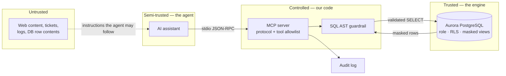

# Threat model: AI agent access to regulated pharmacy data

STRIDE over the data flow this repository implements. Scoped tightly — a threat
model that covers everything gets read by nobody.

**System under analysis:** an AI coding assistant querying a pharmacy database
containing GDPR Article 9 health data, via an MCP server, on AWS.

---

## Data flow and trust boundaries



**Trust boundary 1 — untrusted content → agent.** The one most designs miss. The
agent reads text; text can contain instructions. Anything the agent reads is a
potential command channel.

**Trust boundary 2 — agent → MCP server.** The agent is *semi-trusted*: it is our
software, but its behaviour is a function of untrusted input. Treated as a hostile
client that happens to usually cooperate.

**Trust boundary 3 — server → database.** The only boundary enforced by something
we did not write. This is why it is load-bearing.

---

## The central assumption

> **The agent will eventually follow hostile instructions.**

Not "might". Prompt injection has no general solution, and the agent's entire job
is reading text it did not author. Every control below assumes injection succeeds
and asks: *what can the agent do then?*

This reframes the whole design. The question is never "how do we stop the model
being tricked" — it is "what is the blast radius when it is".

---

## STRIDE

### Spoofing

| Threat | Mitigation | Residual |
|---|---|---|
| Agent impersonates another principal | Dedicated DB role per agent; session tagging | Low |
| Malicious MCP server impersonates an approved one | Version pinning + integrity check (`docs/04`) | **Medium** — depends on review discipline |
| Stolen agent credential reused | IAM DB auth (no long-lived password) in AWS | Low |

### Tampering

| Threat | Mitigation | Residual |
|---|---|---|
| Agent modifies production data | Three layers: AST guardrail (`read-only`), no `INSERT/UPDATE/DELETE` grant, `default_transaction_read_only`. Proven in `evidence/db-privilege-proof.txt` | **Very low** |
| CTE-wrapped write evades a naive filter | AST walk checks node type anywhere in the tree, not statement prefix | Very low |
| Agent alters its own audit trail | Audit is append-only to a separate sink; agent role has no access to it | Low |
| Agent modifies IaC to weaken controls | Branch protection, human review, IaC policy scan | **Medium** — human-dependent |

### Repudiation

| Threat | Mitigation | Residual |
|---|---|---|
| Cannot attribute a query to an agent run | Structured audit: tool, outcome, principal, session, row count, duration | Low |
| Audit itself leaks the data it records | Arguments are **fingerprinted, not stored** — a SQL predicate can contain a personnummer | Low |
| Audit written to stdout, corrupting the protocol | Audit is stderr-only; asserted by a conformance test | Very low |

### Information disclosure — *the primary risk*

| Threat | Mitigation | Residual |
|---|---|---|
| Agent reads raw personnummer / email / phone | No grant on base tables; masked views only | **Very low** |
| Agent reads Art. 9 health data without consent | RLS policy on `prescriptions`; consent is an engine-enforced row filter | **Very low** |
| Agent infers hidden rows from the filter column | `consent_analytics` is itself withheld — a readable filter column is an oracle | Low |
| Bulk extraction by unbounded query | Mandatory `LIMIT` injection + row cap + byte cap + `statement_timeout` | Low |
| Re-identification by combining quasi-identifiers | Postal codes truncated to district, dates generalised to month, given name only | **Medium** — genuinely hard; small country, small population |
| Exfiltration via `COPY TO PROGRAM` / `pg_read_file` | AST function denylist **and** the role lacks superuser | Very low |
| Error messages echo the offending query | Public/internal message split; driver text never serialised | Low |
| Injected instruction tells the agent to dump data | It may comply — and reaches only masked, capped, consented rows | **Bounded, not prevented** |

The last row is the honest one. The design does not stop the agent from *trying*.
It ensures that a fully compromised agent, following hostile instructions with
total application compromise, still gets: masked identifiers, consented rows only,
at most 500 rows, at most 512 KB, within 5 seconds — with every attempt logged.

### Denial of service

| Threat | Mitigation | Residual |
|---|---|---|
| Expensive query exhausts the database | `statement_timeout = 5s` pinned to the role | Low |
| Oversized frame exhausts server memory | 4 MiB frame cap, refused without buffering | Low |
| One malformed frame kills the session | Frames carry refusals as data; server answers and continues (regression-tested) | Low |
| Connection exhaustion | Per-connection autocommit; `idle_in_transaction_session_timeout` | **Medium** — needs pooling at scale |

### Elevation of privilege

| Threat | Mitigation | Residual |
|---|---|---|
| `SET ROLE postgres` | AST refuses `Set` nodes; role cannot assume superuser | Very low |
| Privilege creep via group membership | `NOINHERIT` on the role | Low |
| New tables silently readable | `ALTER DEFAULT PRIVILEGES ... REVOKE` — future tables opt in | Low |
| Function abuse to escalate | Denylist + mask functions are `SECURITY INVOKER`, not `DEFINER` | Low |
| Calling a tool before capability negotiation | Lifecycle ordering enforced as authorisation | Very low |

---

## Attack tree: exfiltrate one patient's prescription history

The scenario a regulator would ask about.

```
GOAL: obtain a named individual's medication history
├── 1. Query the base table directly
│   └── BLOCKED: no SELECT grant on prescriptions.prescriber_hsa_id;
│       relation not in agent allowlist
├── 2. Read the masked view and reverse the mask
│   ├── 2a. Brute-force the hash — personnummer space is enumerable
│   │   └── PARTIALLY MITIGATED: salt in Secrets Manager, not in the view.
│   │       ⚠️ Residual risk if the salt leaks. Rotate on suspicion.
│   └── 2b. Join masked view to an external identified dataset
│       └── MITIGATED: deterministic mask is stable, so this works IF the
│           attacker already has an identified corpus. Row caps bound scale.
├── 3. Read rows for a non-consenting subject
│   └── BLOCKED: RLS filters in the engine, not the query
├── 4. Escalate to superuser and bypass RLS
│   └── BLOCKED: SET ROLE refused twice (AST, then engine)
├── 5. Read the database file from disk
│   └── BLOCKED: pg_read_file denied by AST and by role privilege
├── 6. Inject instructions so the agent exfiltrates for us
│   └── BOUNDED: agent complies but is confined to masked, consented,
│       capped output — and every call is audited
└── 7. Compromise the MCP server process itself
    └── BOUNDED: this is the scenario layer 3 exists for. Full process
        compromise still yields only what mcp_readonly can reach.
```

**Branch 2a is the real residual risk** and the repository does not pretend
otherwise. A deterministic mask with a leaked salt is reversible for a small
identifier space. The mitigations are operational, not architectural: keep the
salt in Secrets Manager, rotate on suspicion of exposure, and monitor for bulk
reads of the masked view — which is exactly what the detection in
`terraform/detections/` watches for.

---

## Assumptions that would invalidate this model

Worth listing, because a threat model whose assumptions are unstated silently
expires:

1. The agent has no network egress other than the MCP server. If it can reach the
   internet directly, exfiltration is trivial regardless of these controls.
2. The masking salt is not in version control and not readable by the agent role.
3. Nobody grants the agent role additional privileges without review.
4. The database is not shared with a service that has wider grants under the same
   role.
5. Audit logs are shipped off-host and retained beyond the agent's reach.

If any of these stops holding, re-run this model. Assumption 1 is the one most
likely to be quietly violated during a feature push.
