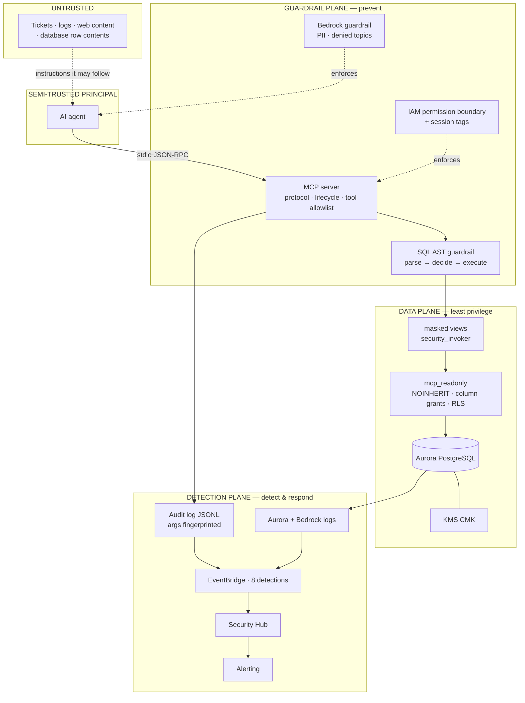

# Architecture

Three planes. Every control belongs to exactly one, which makes the compliance
map mechanical rather than hand-wavy and gives a shared vocabulary for "where
does this new thing go?".

## The invariant: defence in depth, ordered by who enforces it

| Layer | Enforced by | Fails how |
|---|---|---|
| 1. Protocol + tool allowlist | Our code (`mcp_core`) | Bug, logic error |
| 2. SQL AST guardrail | Our code (`guardrails.py`) | Parser gap, missed node type |
| 3. **Database role, grants, RLS** | **PostgreSQL** | Only by an explicit DDL change |

Layers 1 and 2 are application code and *will* eventually have a bug — this
repository found two in itself during construction. Layer 3 is the one that
holds when they do: `evidence/db-privilege-proof.txt` demonstrates 19 refusals
issued by the engine with the application entirely out of the picture.

Ordering them this way is the point. A design where the application layer is the
only thing between an agent and Article 9 data is a design with one bug between
it and a breach.

## Trust boundaries

**1. Untrusted content → agent.** The boundary most designs miss. The agent
reads text; text can contain instructions. Anything it reads is a potential
command channel — including a `notes` column an attacker can write to.

**2. Agent → MCP server.** The agent is *semi-trusted*: our software, but its
behaviour is a function of untrusted input. Treated as a hostile client that
usually cooperates.

**3. Server → database.** The only boundary enforced by something we did not
write. Hence load-bearing.

## Why the agent is a separate principal everywhere

The same decision recurs at three layers, and it is the same reasoning each
time — a shared identity collapses the boundary:

| Layer | Application | Agent |
|---|---|---|
| Database role | `app_owner`, read/write | `mcp_readonly`, SELECT on masked views only |
| IAM role | `ApiRole` | `AgentRole`, with a permission boundary |
| Lambda | `ApiFunction` | `AgentFunction`, isolated subnet |

Sharing any one of them would be simpler. It would also mean a prompt injection
in the agent path executes with the application's write access.

## Where each control lives

| Control | Plane | Implemented in |
|---|---|---|
| Protocol lifecycle as authorisation | Guardrail | `mcp_core/server.py` |
| Statement shape, relation allowlist, row/byte caps | Guardrail | `rds_readonly_mcp/guardrails.py` |
| Permission boundary, `rds-db:connect` scoping | Guardrail | `terraform/modules/agent-data-access` |
| PII filters, denied topics, guardrail-or-refuse endpoint policy | Guardrail | `terraform/modules/bedrock-guardrails` |
| Wildcard IAM / log retention / VPC attachment | Guardrail | `cdk/lib/aspects/security-aspects.ts` |
| Role privileges, column grants, RLS | Data | `rds_readonly_mcp/sql/01-roles.sql` |
| Masking and generalisation | Data | `rds_readonly_mcp/sql/02-masked-views.sql` |
| Encryption, IAM auth, forced TLS | Data | `terraform/modules/aurora-secure` |
| Per-invocation audit, arguments fingerprinted | Detection | `mcp_core/audit.py` |
| 8 detections with ATT&CK mappings | Detection | `terraform/detections` |

## Two decisions worth defending

**Masking lives in the database, not the application.** Masking in Python means
the raw personnummer crosses the network, sits in a result buffer, and is one
logging statement from disclosure. Masking in a view with `security_invoker`
means the plaintext never leaves the engine for this role.

**Consent is a row filter, not a `WHERE` clause.** GDPR lawful basis enforced by
RLS cannot be forgotten by a query that omits it. This is privacy-by-design in
the strict sense: the control is in the schema, not in a review checklist.

## What this architecture does not solve

- **Prompt injection is bounded, not prevented.** A successfully injected agent still reaches only masked, consented, capped data — but it is still injected.
- **Re-identification by combining quasi-identifiers** remains a genuine residual risk in a country of ten million people. See `docs/01-threat-model.md`, branch 2a.
- **A determined insider with agent access is logged, not stopped.** Detection is the control there.
