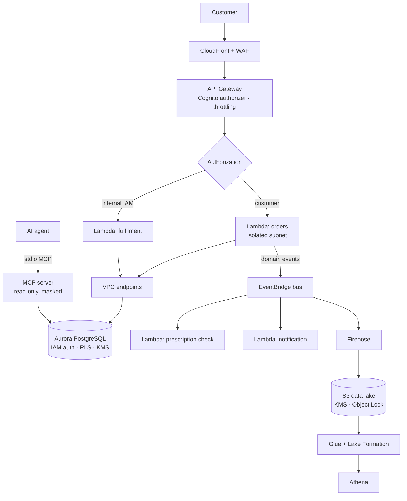

# Serverless reference architecture

An end-to-end design for a regulated e-commerce pharmacy on AWS, serverless-first.
This is the target architecture; `infra/cdk/` implements a working slice of it.

**The governing shift:** serverless removes almost all host-level attack surface
and moves the risk into **identity and configuration**. There is no server to
patch — there is an IAM policy to get wrong. Budget accordingly: identity,
data-plane authorisation, and evidence, not endpoint hardening and perimeter.

---

## 1. End-to-end request path



## 2. VPC design

Three subnet tiers, and the third is where the security is:

| Tier | Contains | Route to internet |
|---|---|---|
| Public | ALB / NAT (only if genuinely needed) | Yes |
| Private with egress | Workloads needing outbound calls | Via NAT |
| **Private isolated** | **Lambdas touching Article 9 data, Aurora** | **None** |

**Isolated is the default for anything touching regulated data.** A function that
can reach the internet and the prescriptions table is one prompt injection or one
dependency compromise away from being an exfiltration channel. `infra/cdk/`
provisions **zero NAT gateways** for exactly this reason — it also happens to
save roughly USD 32/month per AZ, but that is a side effect, not the argument.

### VPC endpoints

Isolated subnets need endpoints for everything AWS-native:

| Endpoint | Type | Why |
|---|---|---|
| S3, DynamoDB | Gateway | Free; no reason not to |
| Secrets Manager, KMS, CloudWatch Logs | Interface | Credential and log paths must not traverse the internet |
| `bedrock-runtime` | Interface | Inference traffic stays in-VPC; also a data-residency control |
| STS, ECR (api + dkr) | Interface | Role assumption and image pulls |

**Endpoint policies are the under-used control.** An endpoint policy can deny
access to buckets outside your account — which turns "exfiltrate to my own S3
bucket" from a working technique into a denied API call. The Bedrock endpoint in
`modules/bedrock-guardrails` uses this to deny any invocation that omits the
guardrail identifier.

### Security groups

- **Egress enumerated, never `allowAllOutbound`.** The CDK stack lists two rules: 443 to the VPC CIDR, 5432 to Aurora.
- **Ingress by security-group reference, not CIDR.** `modules/aurora-secure` has *no ingress-CIDR variable at all* — an interface that cannot express `0.0.0.0/0` cannot be pressured into it.
- One security group per role, not per environment. Shared groups accumulate rules nobody can attribute.

---

## 3. API security

Layered, because each layer catches what the one above misses:

| Layer | Control | Catches |
|---|---|---|
| Edge | WAF managed rules, rate-based rules, geo | Volumetric abuse, generic injection probes |
| Edge | CloudFront + TLS 1.2+ minimum | Downgrade attempts |
| Gateway | Cognito / JWT authorizer for customers; **IAM auth** for internal | Unauthenticated access |
| Gateway | Request validation against a JSON Schema | Malformed input before it reaches compute |
| Gateway | Per-method throttling and usage plans | One client exhausting concurrency |
| Gateway | Access logs on; **`dataTraceEnabled: false`** | See below |
| Compute | Input validation in the handler | Business-logic abuse |
| Data | Parameterised queries, least-privilege role | Injection reaching the database |

**`dataTraceEnabled` must be false on any endpoint serving pharmacy data.** It
logs request and response bodies into CloudWatch — a second copy of personal data
in a store with weaker access controls than the database it came from. This is
the same mistake as enabling full query logging on Aurora, and the CDK test suite
asserts it stays off.

**Authorizer choice:** IAM auth for service-to-service, because it composes with
SCPs and permission boundaries and needs no token-handling code. Cognito or a
Lambda authorizer for customers. A shared API key is not authentication.

---

## 4. EventBridge and event-driven security

Events are where a serverless architecture becomes auditable — and where it
becomes leaky if the payload is wrong.

**Rule: events carry identifiers, not payloads.** A `PrescriptionDispensed` event
should carry `prescription_id`, not the medication. Consumers that need the
detail read it from the source with their own authorisation. Otherwise every
event bus, DLQ, archive, and log becomes a copy of Article 9 data — and event
archives are retained far longer than anyone remembers.

| Pattern | Security property |
|---|---|
| Bus per domain, not one shared bus | A consumer cannot subscribe to events outside its domain |
| Resource policy on the bus | Only named principals may `PutEvents` |
| DLQ per rule, encrypted, with an alarm | A silently failing rule is a control that stopped working |
| Archive with a bounded retention | Replay capability without an indefinite personal-data store |
| Schema registry | Consumers break loudly on a shape change rather than mis-parsing |

EventBridge is also the **detection substrate** — `infra/terraform/detections/`
uses it for all eight rules. The same bus that carries domain events carries
GuardDuty findings and CloudTrail API calls, which is why one routing design
serves both.

---

## 5. Lambda security

| Control | Setting | Why |
|---|---|---|
| Execution role | One per function | A shared role means a compromise of the least important function grants the most important function's access |
| VPC | Isolated subnet for regulated data | No egress path |
| Runtime | **Pinned** (`PYTHON_3_12`) | "Latest" means an unreviewed runtime change lands in a regulated workload without a change record |
| Concurrency | `reservedConcurrentExecutions` set | Bounds both cost and blast radius during a compromise |
| Environment variables | KMS-encrypted; **no secrets** | Env vars appear in the console, in `GetFunctionConfiguration`, and in some logs. Store a secret *reference*. |
| Log retention | Explicit, bounded | CDK defaults to never expiring |
| DLQ | Considered, often declined | A DLQ retains the failed event payload — for this workload, that is a durable copy of the data that caused the failure |
| Layers | Pinned by version ARN | A layer is code you did not review executing in your function |
| Code signing | Signing profile enforced | Prevents deploying an artifact the pipeline did not build |

**The one people miss:** `reservedConcurrentExecutions`. Unbounded concurrency
turns a compromised function into a bill as well as a breach, and it is the
control that made containment cheap in IR playbook 02 — setting it to zero stops
execution without destroying the function or its logs.

---

## 6. Data pipeline and lake

```
Aurora --CDC/DMS--> Kinesis --> Firehose --> S3 raw --> Glue ETL --> S3 curated --> Athena
                                              |                          |
                                        Object Lock              Lake Formation
                                        KMS CMK                  column/row filters
```

| Stage | Control |
|---|---|
| Ingest | Firehose with KMS; no plaintext transit |
| Raw zone | Bucket policy denying non-TLS; Object Lock in compliance mode for audit data; **no public access block gaps** |
| Transform | Glue job role scoped to specific prefixes, not the bucket |
| Curated | **Lake Formation column and row filters** — the lake equivalent of the masked views |
| Consume | Athena workgroup with an output-location the analyst cannot change |
| Everywhere | Macie for discovery — it finds the Article 9 data that ended up somewhere nobody expected |

**Tokenise at ingest, not at consumption.** If the personnummer enters the lake in
plaintext, every downstream copy, every Athena result set, and every notebook
becomes in-scope. The same argument as masking in the database rather than in the
application, applied one layer out.

---

## 7. Database structures

Three tiers of protection, from `mcp-servers/rds_readonly_mcp/sql/`:

**Structure**
```
pharmacy.customers      -- direct identifiers        [no agent grant]
pharmacy.prescriptions  -- Art. 9 health data        [column grants + RLS]
pharmacy.orders         -- operational               [SELECT]
pharmacy.order_items    -- operational               [SELECT]
pharmacy.products       -- reference                 [SELECT]

pharmacy.v_customers_masked      -- pseudonymised, security_barrier
pharmacy.v_prescriptions_masked  -- pseudonymised, security_invoker + RLS
```

| Mechanism | Applied to | Effect |
|---|---|---|
| Table grants | Operational tables | Agent may read |
| **Absence** of grants | `customers` | Raw PII is unreachable, not merely guarded |
| **Column grants** | `prescriptions` | `prescriber_hsa_id` and `consent_analytics` withheld — the filter column too, because a readable filter column is an oracle for the hidden rows |
| **RLS** | `prescriptions` | Consent as an engine-enforced row filter |
| `security_invoker` views | Masked views | Makes RLS actually apply — without it the view runs as its owner and a superuser owner bypasses RLS entirely |
| `NOINHERIT`, `statement_timeout`, `default_transaction_read_only` | The role | Bounds privilege, runtime, and mutation |
| `ALTER DEFAULT PRIVILEGES ... REVOKE` | Schema | Tomorrow's `CREATE TABLE patient_notes` is not silently readable |

**Aurora specifics:** reader endpoint for analytics (a read-only workload on the
writer competes with transactions it has no business affecting), IAM database
authentication so no password exists, `rds.force_ssl=1`, pgaudit for DDL and role
events only.

---

## 8. Use-case scenarios

Concrete flows, each naming the control that carries it.

**A — Customer places an order containing a prescription item.**
CloudFront/WAF → API Gateway (Cognito) → orders Lambda (isolated subnet) → Aurora writer via IAM auth → `OrderPlaced` event (identifiers only) → prescription-check Lambda reads the detail under its *own* authorisation. *Carried by:* per-function roles and identifier-only events.

**B — An analyst asks the AI assistant for dispensing trends.**
Agent → MCP server → AST guardrail (single SELECT, allowlisted relations, LIMIT injected) → `mcp_readonly` → masked view → RLS filters to consented rows → audit record written. *Carried by:* three independent layers, the last enforced by PostgreSQL.

**C — A developer's assistant is prompt-injected via a ticket description.**
The agent complies. It reaches only masked, consented, capped data; D-001 fires on the refusal burst; IR playbook 03 runs. *Carried by:* bounded blast radius — the design assumes injection succeeds.

**D — A dependency is compromised and mines cryptocurrency in a Lambda.**
The function is in an isolated subnet with no NAT, so it cannot reach a mining pool. GuardDuty fires on the DNS attempt; reserved concurrency bounds the spend. *Carried by:* network isolation doing work the SCA scanner could not.

**E — A leaked CI credential.**
There is none to leak: GitHub Actions uses OIDC with a token scoped to one repo, one ref, valid for the run. *Carried by:* `modules/github-oidc`.

**F — A regulator asks which agent read which health data last quarter.**
Query the audit log. *Carried by:* per-invocation records with fingerprinted arguments — an answer rather than a project.

---

## 9. What this architecture does not address

- **Multi-region resilience.** Single-region by design here; cross-region replication of Article 9 data is a residency decision, not a default.
- **Cost at real traffic.** The isolated-subnet pattern needs interface endpoints, which have an hourly charge per AZ. Cheaper than a NAT gateway, not free.
- **Warehouse/OT systems.** The logistics estate has different constraints and is out of scope here — and is usually the forgotten attack surface.
- **Anything applied to a live account.** All of this is statically validated only.
