# Org. — Senior Security Engineer
## AWS Security Strategy, Architecture & Hands-On Implementation Plan

**Prepared:** 14 August 2026  
**Perspective:** Principal / Senior AWS Security Engineer  
**Scope:** Cloud, application, infrastructure, IAM, serverless, data security, DevSecOps, monitoring, incident response, governance, privacy and AI security.

> **Important:** This is a target-state engineering plan, not an assertion about Org.'s current internal architecture. The first step in a real engagement is discovery and validation against the actual AWS Organization, applications, data flows, controls, contracts and regulatory scope.

---

# 1. Executive Security Strategy

The most defensible way to approach this role is to build security as a **platform capability**, rather than as a collection of disconnected security tools.

The target model is:

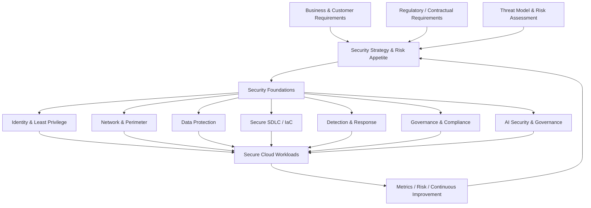

The central principle is:

**Prevent → Detect → Respond → Recover → Learn**

A practical AWS foundation should use a multi-account model with centralized security services and workload isolation. AWS's current Security Reference Architecture recommends separating organizational management, security tooling, log archive, network/shared services and workload accounts, with centralized/delegated administration of appropriate security services. [AWS Security Reference Architecture](https://docs.aws.amazon.com/prescriptive-guidance/latest/security-reference-architecture/architecture.html)

---

# 2. Target AWS Security Architecture

## 2.1 Enterprise-level architecture

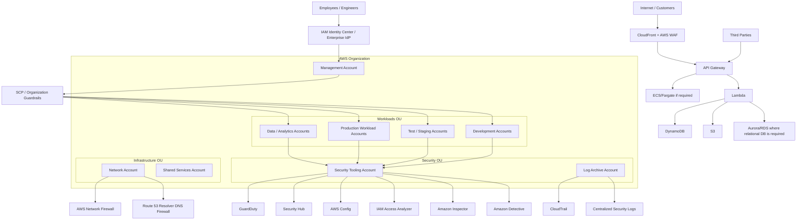

AWS explicitly recommends account-level isolation as a security boundary and recommends multi-account environments as organizations grow. The exact account structure should be adapted to Org.'s size, operating model and compliance requirements. [AWS SRA account and guardrail guidance](https://docs.aws.amazon.com/prescriptive-guidance/latest/security-reference-architecture/organizations.html)

## 2.2 Security account responsibilities

| Account / Boundary | Primary responsibility |
|---|---|
| Management | Organization administration and organization-wide controls |
| Security Tooling | Security Hub, GuardDuty, Config, Detective, Inspector and security administration |
| Log Archive | Central security/audit logs with tightly restricted access |
| Network | Central networking, inspection and DNS controls where appropriate |
| Shared Services | Common platform capabilities |
| Development | Non-production workloads |
| Test/Staging | Production-like validation |
| Production | Customer-facing workloads |
| Data | Sensitive analytics/data workloads where isolation is justified |

Do not automatically create an account for every application. Account boundaries should be driven by isolation, blast radius, ownership, compliance, data classification and operational requirements.

---

# 3. Responsibility 1 — Security Leadership

## Requirement

> Own and evolve Org.'s security strategy across cloud, applications and infrastructure.

## What I would actually do

### Step 1 — Establish the current-state baseline

During the first 2–4 weeks:

1. Inventory AWS Organizations and accounts.
2. Identify production vs non-production accounts.
3. Inventory internet-facing assets.
4. Inventory IAM identities, roles and trust policies.
5. Review root-account controls.
6. Review IAM Identity Center / enterprise IdP integration.
7. Review SCPs and organization policies.
8. Review CloudTrail coverage.
9. Review GuardDuty coverage.
10. Review Security Hub coverage.
11. Review AWS Config coverage.
12. Review encryption/KMS architecture.
13. Review S3 public-access configuration.
14. Review VPC topology.
15. Review security groups and network paths.
16. Review Lambda/API Gateway architecture.
17. Review secrets management.
18. Review CI/CD pipelines.
19. Review Terraform/CDK/CloudFormation repositories.
20. Review vulnerability-management process.
21. Review incident-response procedures.
22. Review third-party integrations.
23. Map important data flows.
24. Identify regulatory and contractual obligations.
25. Establish the top 10 security risks.

### Step 2 — Build a security risk register

Example:

| Risk | Likelihood | Impact | Priority | Treatment |
|---|---:|---:|---:|---|
| Over-privileged IAM role | High | High | Critical | Reduce permissions |
| Public sensitive S3 bucket | Medium | Critical | Critical | Block public access |
| Missing centralized audit logs | Medium | Critical | High | Organization trail |
| Internet-facing API without strong auth | Medium | High | High | Auth + WAF |
| Secrets in source code | Medium | Critical | Critical | Secrets Manager + rotation |
| Vulnerable dependency | High | High | High | SCA + patch SLA |
| Missing incident playbook | Medium | High | High | IR runbooks |
| AI tool data leakage | Medium | High | High | AI governance |

### Step 3 — Define target security principles

1. Identity is the primary security boundary.
2. Least privilege by default.
3. Eliminate long-lived AWS access keys wherever possible.
4. Separate production from non-production.
5. Encrypt sensitive data at rest and in transit.
6. Centralize security telemetry.
7. Treat infrastructure as code.
8. Security controls should be automated.
9. Security findings should be actionable.
10. Customer data should be classified before processing.
11. Sensitive data should not appear in logs.
12. Security should be measurable.
13. Security controls should be tested continuously.
14. Assume breach and minimize blast radius.

AWS's Security Pillar emphasizes strong identity foundations, least privilege, separation of duties and traceability. [AWS Well-Architected Security Pillar](https://docs.aws.amazon.com/wellarchitected/latest/security-pillar/security.html)

---

# 4. Responsibility 2 — Translate Business and Regulatory Requirements

Security architecture should begin with requirements, not AWS services.

## Step-by-step

### Step 1 — Identify data and business processes

For an online pharmacy/e-commerce environment, identify at least:

- Customer identity data
- Contact information
- Order information
- Payment-related information
- Pharmacy/health-related information where applicable
- Prescription-related information where applicable
- Employee information
- Supplier/partner information
- Product information
- Application telemetry
- Security logs
- AI prompts and outputs
- Marketing/analytics data

Do not assume that every dataset is health data. Classify it based on actual data content and legal advice.

### Step 2 — Data classification

Example:

```text
PUBLIC
  Product catalogue
  Public website content

INTERNAL
  Non-sensitive operational information

CONFIDENTIAL
  Business information
  Employee information
  Internal operational data

RESTRICTED
  Sensitive customer information
  Health-related/prescription information
  Security credentials
  Payment/security-sensitive information
```

### Step 3 — Map requirements to controls

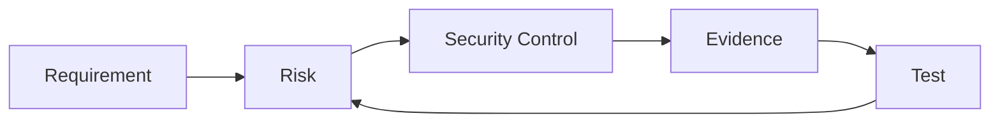

For each requirement:

**Requirement → Risk → Control → Implementation → Evidence → Test → Owner**

### Step 4 — Regulatory scope

For a Swedish/EU organization, perform an applicability assessment rather than blindly claiming that every framework applies.

Potential areas to assess include:

- GDPR
- Swedish privacy/data-protection requirements
- Sector-specific pharmacy/healthcare requirements
- Payment security requirements such as PCI DSS where applicable
- NIS2 applicability where legally applicable
- Contractual security requirements
- ISO 27001 if used by the organization
- NIST CSF/800-series as control/engineering references where useful

GDPR is a legal requirement; ISO 27001 and NIST are frameworks/standards that may be used to structure controls. They should not be presented as interchangeable legal obligations.

---

# 5. Responsibility 3 — Define Security Guardrails and Reference Implementations

The goal is to make the secure path the easiest path.

## Guardrail layers

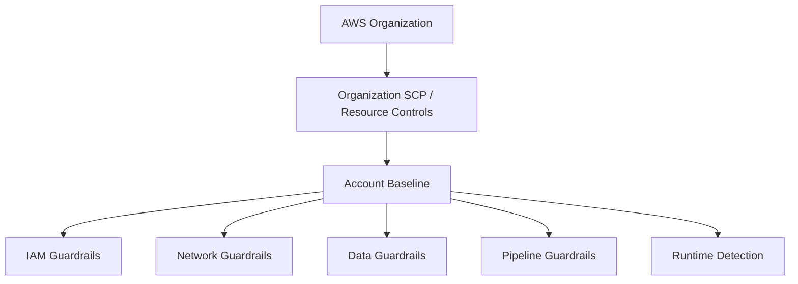

## Example guardrails

### Organization

- Restrict unauthorized Regions where business requirements permit.
- Protect security accounts.
- Prevent disabling mandatory security services.
- Prevent leaving the organization.
- Restrict risky IAM actions.
- Require approved account baselines.

### IAM

- No shared human IAM users.
- Prefer federated workforce identity.
- MFA.
- Temporary credentials.
- Permission boundaries where appropriate.
- Resource policies reviewed.
- Explicit denies for especially sensitive actions where justified.
- IAM Access Analyzer.
- Regular access review.

### S3

- Block public access by default.
- Encryption.
- Versioning where required.
- TLS-only bucket policies.
- Restrict cross-account access.
- Lifecycle management.
- Sensitive-data discovery where justified.

### Lambda

- Dedicated execution role.
- Minimal permissions.
- Separate roles by function.
- No embedded secrets.
- Dependency scanning.
- Runtime logging without sensitive data.
- Reserved concurrency where abuse protection is needed.
- API authorization.
- WAF for appropriate public endpoints.

### CI/CD

- Protected branches.
- Mandatory review.
- Dependency scanning.
- SAST.
- SCA.
- Secret scanning.
- IaC scanning.
- Container scanning where containers are used.
- Artifact integrity.
- Deployment-role separation.
- Production approval gates.

---

# 6. Responsibility 4 — Hands-On Secure AWS Serverless Architecture

## Reference architecture

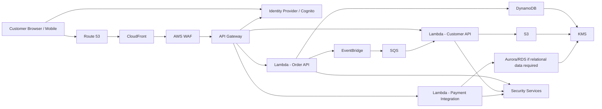

## Security design

### Internet edge

1. Route 53 for DNS.
2. CloudFront for distribution where appropriate.
3. AWS WAF for application-layer protection.
4. TLS certificates through ACM.
5. API Gateway as the controlled API boundary.
6. Strong authentication and authorization.

AWS documents API Gateway as a common secure front door for serverless APIs and recommends appropriate authorization mechanisms; WAF can protect against common web exploits such as SQL injection and XSS. [AWS Lambda public endpoint security](https://docs.aws.amazon.com/lambda/latest/dg/security-public-endpoints.html)

### Authentication

Use an established identity provider rather than implementing password authentication yourself.

Potential models:

- Cognito for customer identity.
- Enterprise IdP + IAM Identity Center for workforce identity.
- OIDC federation for CI/CD.
- IAM authorization for service-to-service AWS access.

Do not confuse:

- API key = identification/quota mechanism, not a strong user authentication solution.
- JWT = token format/claims mechanism.
- OAuth 2.0 = delegated authorization framework.
- OIDC = authentication identity layer built on OAuth 2.0.
- IAM role = AWS authorization mechanism.

### Lambda

Each Lambda function should have its own execution role when practical.

Bad:

```text
OrderLambdaRole
  -> AdministratorAccess
```

Better:

```text
OrderLambdaRole
  -> dynamodb:GetItem
  -> dynamodb:PutItem
  -> only approved table
  -> kms:Decrypt
  -> only approved KMS key
```

AWS explicitly recommends granting only the access required for specific actions, resources and conditions. [Least privilege guidance](https://docs.aws.amazon.com/wellarchitected/latest/framework/sec_permissions_least_privileges.html)

---

# 7. Responsibility 5 — Secure Data Architecture

## Data-security lifecycle

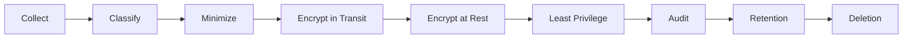

## Controls

### S3

- Block Public Access.
- Bucket policy with TLS requirement.
- SSE-KMS for sensitive data where appropriate.
- Key policy reviewed.
- Versioning for recovery requirements.
- Lifecycle policies.
- Access logging/CloudTrail data events where justified.
- Macie where sensitive-data discovery is required.
- Cross-account access explicitly controlled.

### DynamoDB

- Encryption at rest.
- IAM-based access.
- Fine-grained access patterns where applicable.
- Avoid sensitive data in keys if possible.
- CloudTrail API auditing.
- Backup/PITR based on recovery requirements.

### RDS/Aurora

- Private subnets.
- Security groups restricted to application security groups.
- Encryption with KMS.
- TLS connections.
- Secrets Manager for credentials where credentials are necessary.
- Automated backups.
- Multi-AZ based on availability requirements.
- Database auditing appropriate to the engine and regulatory needs.
- No public database endpoint unless explicitly justified.

### KMS

Use separate keys based on isolation requirements.

```text
KMS
├── Application data key
├── Database encryption key
├── S3 restricted-data key
├── Log archive key
└── Backup key
```

Do not create hundreds of keys without a reason. Key boundaries should support security, ownership, rotation, separation and recovery.

---

# 8. Responsibility 6 — IAM and Zero Trust

## Target model

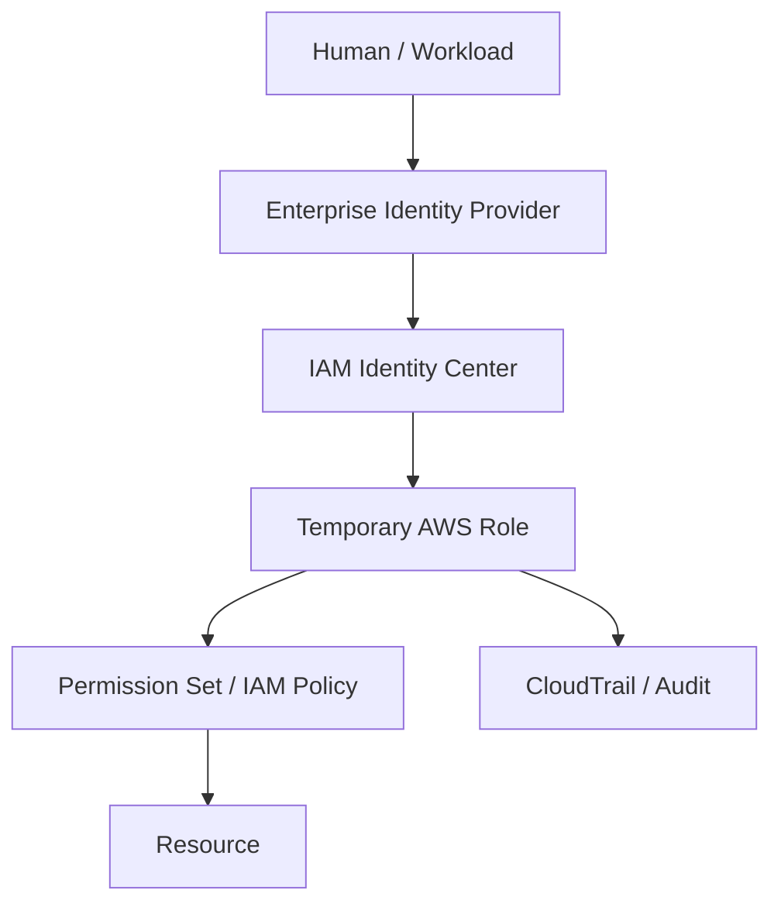

## Step-by-step IAM program

### Phase 1 — Identity inventory

Identify:

- Human identities.
- Service roles.
- Cross-account roles.
- CI/CD roles.
- Third-party roles.
- Lambda execution roles.
- ECS task roles.
- EC2 instance roles.
- Break-glass roles.

### Phase 2 — Remove dangerous patterns

Find:

- `AdministratorAccess` used unnecessarily.
- `Action: "*"` .
- `Resource: "*"` where not necessary.
- Long-lived access keys.
- Trust policies allowing unintended principals.
- Cross-account roles without external conditions.
- Roles assumable by broad principals.
- Unused roles.
- Orphaned users.

### Phase 3 — Permission design

Use:

```text
Principal
+
Action
+
Resource
+
Condition
```

Example conceptual policy:

```json
{
  "Effect": "Allow",
  "Action": [
    "dynamodb:GetItem",
    "dynamodb:PutItem"
  ],
  "Resource": "arn:aws:dynamodb:eu-north-1:ACCOUNT:table/Orders",
  "Condition": {
    "StringEquals": {
      "aws:PrincipalTag/Environment": "production"
    }
  }
}
```

The exact policy must be validated against the actual application and AWS service authorization model before deployment.

### Phase 4 — Continuous validation

Use:

- IAM Access Analyzer.
- CloudTrail.
- IAM policy analysis.
- Access Advisor where useful.
- Security Hub controls.
- CI policy linting.
- Periodic entitlement reviews.

---

# 9. Responsibility 7 — Secrets Management

Never put secrets in:

```text
Git
Dockerfile
Terraform variables committed to Git
Lambda source
CloudFormation templates
CI logs
Plaintext pipeline variables
```

Preferred:

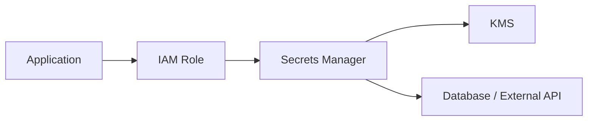

Use Secrets Manager for secrets requiring lifecycle management and rotation.

Use Systems Manager Parameter Store for appropriate configuration/parameter use cases.

AWS CodePipeline/CodeBuild documentation specifically warns against putting sensitive values into plaintext environment variables and recommends Secrets Manager for secrets. [AWS CodePipeline security](https://docs.aws.amazon.com/codepipeline/latest/userguide/security-best-practices.html)

---

# 10. Responsibility 8 — Vulnerability Management

## Vulnerability lifecycle

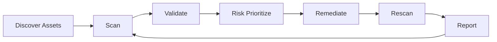

## Coverage

### Source code

- SAST
- SCA
- Secret scanning
- Dependency scanning

### IaC

- Terraform
- CloudFormation
- CDK synthesized templates

Tools may include:

- Checkov
- tfsec
- cfn-lint
- Semgrep
- SonarQube

Use tools as complementary controls; do not treat a single scanner as proof of security.

### Containers

Where containers are used:

- Trivy
- Amazon Inspector
- ECR scanning
- SBOM generation
- Image signing/provenance

### Runtime

- Amazon Inspector for supported compute workloads.
- GuardDuty.
- Security Hub.
- Config.
- EDR where endpoints/workloads require it.

## Risk-based remediation

Example SLA:

```text
Critical exploitable internet-facing issue
    -> immediate investigation / emergency remediation

Critical internal issue
    -> very short remediation window

High
    -> prioritized sprint remediation

Medium
    -> normal remediation backlog

Low
    -> planned maintenance
```

Exact SLAs should be approved by risk owners.

Do not prioritize vulnerabilities solely by CVSS. Consider:

- Internet exposure
- Exploitability
- Asset criticality
- Data sensitivity
- Compensating controls
- Active exploitation
- Business impact

---

# 11. Responsibility 9 — Secure DevSecOps Pipeline

## Reference pipeline

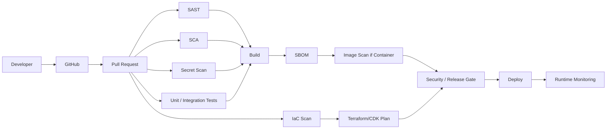

## Pipeline security controls

### Pull request

- Branch protection.
- CODEOWNERS.
- Mandatory review.
- Secret scanning.
- SAST.
- SCA.
- IaC scanning.
- Dependency pinning where appropriate.

### Build

- Ephemeral runners where practical.
- Minimal build role.
- No static AWS keys.
- OIDC federation.
- Immutable artifacts.
- SBOM.
- Artifact integrity.

### Deployment

Use separate deployment roles:

```text
GitHub OIDC
    |
    v
NonProdDeployRole
    |
    v
ProductionApproval
    |
    v
ProdDeployRole
```

Avoid giving the CI system broad administrative access to the entire AWS organization.

### CDK/Terraform

Pipeline should run:

```text
fmt
validate
lint
security scan
unit tests
plan/synth
policy validation
approval
deploy
post-deployment validation
```

---

# 12. Responsibility 10 — Monitoring, SIEM and Detection

## Target detection architecture

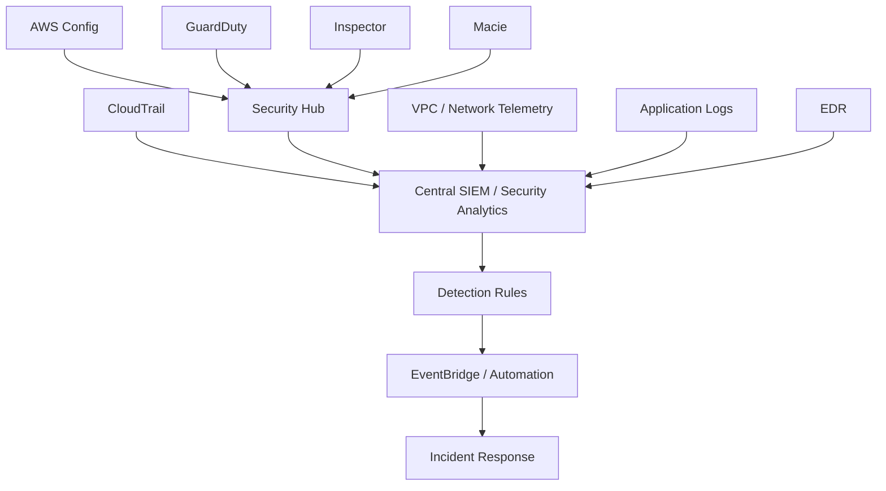

AWS GuardDuty provides continuous monitoring and can consume security-relevant data sources such as CloudTrail, VPC flow logs, DNS logs and workload telemetry; findings can be consumed through EventBridge. [GuardDuty documentation](https://docs.aws.amazon.com/guardduty/latest/ug/security.html)

AWS Security Hub provides centralized security findings and integrates with other AWS security services. [Security Hub documentation](https://docs.aws.amazon.com/securityhub/latest/userguide/sh-security.html)

## Core telemetry

### Control plane

- CloudTrail management events.
- Organization-wide trail.
- Protected centralized log destination.
- Restricted access.

### Data plane

Enable data events selectively for high-value resources where the volume/cost is justified:

- Sensitive S3 buckets.
- Critical Lambda functions.
- Other critical resource types.

### Network

- VPC Flow Logs where justified.
- DNS telemetry.
- WAF logs.
- Load balancer/API logs.

### Application

- Authentication events.
- Authorization failures.
- Sensitive business actions.
- Privileged operations.
- Security-relevant errors.

Do not log:

- Passwords.
- Access tokens.
- API secrets.
- Full payment card data.
- Sensitive health information unless explicitly required and protected.

CloudTrail is a key audit source for AWS API activity. [CloudTrail security documentation](https://docs.aws.amazon.com/awscloudtrail/latest/userguide/WhatIsCloudTrail-Security.html)

---

# 13. Responsibility 11 — Detection Engineering

Do not simply deploy GuardDuty and call monitoring complete.

Build detections around threats.

## Example detections

### Identity compromise

```text
Impossible/unusual login
+
New access key
+
Unusual API activity
+
Privilege escalation
=
High-confidence identity investigation
```

### Suspicious AWS activity

Detect:

- Root account activity.
- CloudTrail disabled.
- GuardDuty disabled.
- Security Hub disabled.
- IAM policy changes.
- New highly privileged role.
- Trust policy modified.
- Security group opened to the Internet.
- S3 bucket public-access changes.
- KMS key policy changes.
- Unusual Region activity.
- Unexpected infrastructure deployment.

### Application attacks

Detect:

- WAF blocks.
- SQL injection attempts.
- XSS attempts.
- Credential stuffing.
- Abnormal API error rates.
- Authorization failures.
- Excessive API calls.

---

# 14. Responsibility 12 — Incident Response

## IR architecture

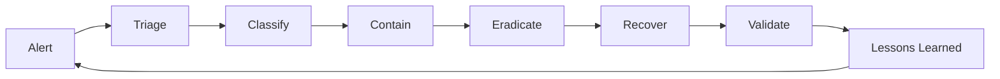

## Incident severity

Example:

```text
SEV-1
Active compromise / material customer or business impact

SEV-2
Confirmed security incident with limited scope

SEV-3
Security event requiring investigation

SEV-4
Low-risk security anomaly
```

Actual severity criteria must be agreed with the business.

## Example: compromised IAM role

### Step 1 — Detect

GuardDuty/SIEM detects unusual API activity.

### Step 2 — Triage

Determine:

- Principal.
- Source IP.
- User agent.
- First observed event.
- Last observed event.
- Resources accessed.
- Actions performed.
- Data accessed.
- Persistence mechanisms.

### Step 3 — Contain

Potential actions:

- Disable/revoke compromised credentials.
- Remove malicious sessions where applicable.
- Apply temporary restrictive policy.
- Isolate affected workload.
- Block malicious network indicators.
- Preserve evidence.

Do not immediately destroy the compromised resource if doing so would destroy forensic evidence, unless immediate business/safety risk requires it.

### Step 4 — Investigate

Use:

- CloudTrail.
- GuardDuty.
- Security Hub.
- Detective where appropriate.
- Application logs.
- VPC telemetry.
- EDR telemetry.

### Step 5 — Eradicate

- Remove unauthorized IAM changes.
- Rotate exposed secrets.
- Patch vulnerabilities.
- Remove persistence.
- Validate trust policies.

### Step 6 — Recover

- Restore clean configuration.
- Validate controls.
- Monitor closely.
- Communicate status.

### Step 7 — Lessons learned

Update:

- Detection.
- Guardrail.
- Playbook.
- IAM policy.
- Pipeline.
- Training.
- Architecture.

---

# 15. Responsibility 13 — Incident Playbooks

Maintain tested playbooks for at least:

1. Compromised IAM credentials.
2. Public S3 bucket.
3. Ransomware/malware.
4. Compromised Lambda.
5. Compromised container.
6. Exposed secret.
7. Data exfiltration.
8. API attack.
9. Supply-chain compromise.
10. CloudTrail/security logging disruption.
11. Malicious insider.
12. Third-party compromise.
13. AI data leakage.
14. DDoS/WAF event.

## Playbook structure

```text
Purpose
Scope
Severity
Detection
Initial triage
Containment
Evidence preservation
Eradication
Recovery
Communications
Legal/privacy escalation
Customer impact assessment
Post-incident review
Detection improvements
```

---

# 16. Responsibility 14 — Governance and Compliance

## Security-by-design lifecycle

```mermaid
flowchart LR
    IDEA[Product Idea]
    DATA[Data Classification]
    THREAT[Threat Model]
    DESIGN[Secure Architecture]
    PRIV[Privacy Review]
    BUILD[Secure Build]
    TEST[Security Testing]
    RELEASE[Release]
    MONITOR[Runtime Monitoring]
    REVIEW[Continuous Review]

    IDEA --> DATA
    DATA --> THREAT
    THREAT --> DESIGN
    DESIGN --> PRIV
    PRIV --> BUILD
    BUILD --> TEST
    TEST --> RELEASE
    RELEASE --> MONITOR
    MONITOR --> REVIEW
    REVIEW --> DESIGN
```

## Threat modeling

For each important application:

1. Identify assets.
2. Identify actors.
3. Draw trust boundaries.
4. Identify data flows.
5. Identify entry points.
6. Identify privileged operations.
7. Identify abuse cases.
8. Identify threats.
9. Map controls.
10. Record residual risk.

Useful approaches:

- STRIDE.
- Attack trees.
- Abuse cases.
- MITRE ATT&CK for detection/response thinking.

---

# 17. GDPR and Privacy-by-Design

The security engineer should not act as the legal authority, but should turn legal/privacy requirements into technical controls.

## Technical control mapping

| Privacy objective | Engineering control |
|---|---|
| Data minimization | Collect/store only required fields |
| Purpose limitation | Separate data uses |
| Access control | IAM/application authorization |
| Confidentiality | Encryption + least privilege |
| Integrity | Immutable/auditable changes |
| Accountability | Audit logging |
| Retention | Lifecycle/deletion controls |
| Data subject rights | Application workflows |
| Breach readiness | Detection + IR |
| Vendor governance | Third-party security assessment |

For sensitive personal data, define:

```text
Data owner
Purpose
Legal basis
Classification
Storage location
Processing systems
Access roles
Retention period
Deletion method
Third-party processors
International transfers
Logging requirements
```

Do not put sensitive personal information into operational tags or arbitrary log fields.

AWS's Lambda security guidance also warns against putting confidential or sensitive information into tags/name fields because such information can appear in logs or diagnostics. [AWS Lambda data protection](https://docs.aws.amazon.com/lambda/latest/dg/security-dataprotection.html)

---

# 18. Healthcare / Pharmacy Data

A key interview point:

**Do not automatically equate “pharmacy” with HIPAA.**

HIPAA is a US regulatory regime. For a Swedish organization, determine the actual applicable Swedish/EU legal requirements and whether the workload has US healthcare obligations.

The engineering process is:

```text
Identify data
    ↓
Determine whether it is health-related/prescription information
    ↓
Legal/privacy classification
    ↓
Determine applicable regulation
    ↓
Map regulation to controls
    ↓
Implement
    ↓
Collect evidence
    ↓
Test
```

If HIPAA ever applies to a specific workload, AWS requires customers to use HIPAA-eligible services appropriately and satisfy their own responsibilities under the shared-responsibility model. The current AWS HIPAA-eligible services reference should be checked at implementation time. [AWS HIPAA eligibility](https://aws.amazon.com/compliance/hipaa-compliance/)

---

# 19. Responsibility 15 — AI Security

The requirement:

> Provide training and frameworks for safe AI usage without compromising security.

## AI threat model

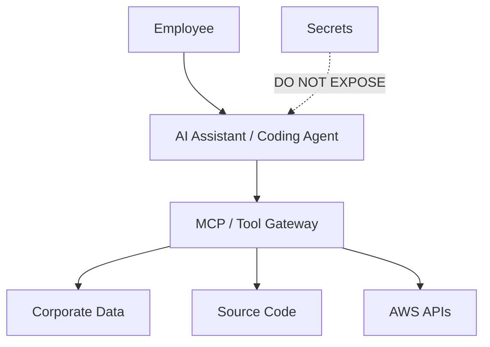

## AI security policy

### Employees must not

- Paste credentials into public AI tools.
- Paste production secrets.
- Upload sensitive customer data without authorization.
- Upload health/prescription data without approved processing.
- Give AI agents unrestricted cloud credentials.
- Allow agents to execute destructive operations without controls.
- Treat generated code as automatically secure.

### Approved AI architecture

```text
Developer
   |
   v
Enterprise AI Gateway
   |
   +--> Identity / SSO
   +--> DLP
   +--> Prompt filtering
   +--> Data classification
   +--> Policy engine
   +--> Audit logging
   +--> Model routing
   |
   v
Approved AI Provider
```

For agentic systems:

```text
AI Agent
   |
   v
Tool Gateway / MCP
   |
   v
Policy Engine
   |
   +--> Read-only tools
   +--> Controlled write tools
   +--> High-risk tools require approval
   |
   v
AWS / SaaS / Databases
```

## AI least privilege

Never give an AI agent:

```text
AdministratorAccess
```

Prefer:

```text
AI Security Investigation Role
  -> read Security Hub findings
  -> read selected CloudWatch logs
  -> read selected GuardDuty findings
  -> no IAM write
  -> no production deletion
  -> no secret retrieval unless explicitly required
```

For destructive operations:

```text
AI proposes
    ↓
Policy engine evaluates
    ↓
Human approval
    ↓
Short-lived privileged role
    ↓
Action
    ↓
Audit
```

---

# 20. Responsibility 16 — Collaboration and Security Culture

Security should be an engineering enablement function.

## Security engagement model

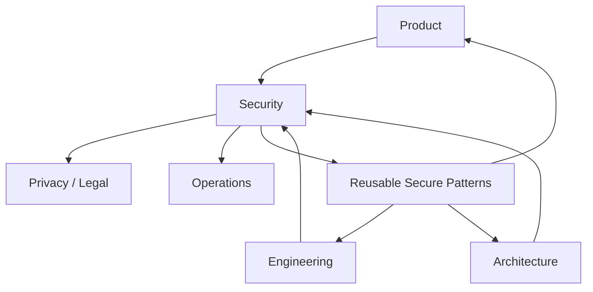

## Practical activities

### Weekly

- Security office hours.
- Review new security findings.
- Review production risks.
- Review critical vulnerabilities.

### Monthly

- Security posture review.
- IAM access review.
- Detection review.
- Incident metrics.
- Architecture reviews.

### Quarterly

- Threat-model important systems.
- Test incident playbooks.
- Review security architecture.
- Review third-party risk.
- Review regulatory evidence.

---

# 21. Secure Reference Implementations

Create reusable golden paths.

## Golden path: Serverless API

```text
CloudFront
  ↓
AWS WAF
  ↓
API Gateway
  ↓
Authorizer
  ↓
Lambda
  ↓
DynamoDB
```

Mandatory baseline:

- TLS.
- Authentication.
- Authorization.
- WAF where appropriate.
- Rate limiting/throttling.
- IAM least privilege.
- KMS encryption.
- Structured logging.
- CloudTrail.
- Security monitoring.
- CI/CD security checks.

## Golden path: Data API

```text
API Gateway
  ↓
Lambda
  ↓
Private integration where needed
  ↓
Aurora/RDS
```

Mandatory:

- No public database.
- Security-group restrictions.
- Secrets Manager.
- KMS.
- TLS.
- Database auditing.
- Backup.
- Monitoring.
- Dependency scanning.

---

# 22. Infrastructure as Code Security

## Terraform workflow

```text
Developer
  ↓
Terraform code
  ↓
terraform fmt
  ↓
terraform validate
  ↓
Checkov / tfsec
  ↓
Policy tests
  ↓
terraform plan
  ↓
Security review
  ↓
Approved apply
```

## CDK workflow

```text
TypeScript/Python
  ↓
Unit tests
  ↓
CDK synth
  ↓
CloudFormation template
  ↓
Template/security validation
  ↓
Policy checks
  ↓
Deploy
```

Important principle:

**Scan the synthesized infrastructure representation, not only the high-level code.**

For CDK, inspect the generated CloudFormation because security mistakes can be introduced by constructs or configuration.

---

# 23. Example Security-as-Code Controls

## Terraform conceptual example

```hcl
resource "aws_s3_bucket_public_access_block" "restricted" {
  bucket = aws_s3_bucket.data.id

  block_public_acls       = true
  block_public_policy     = true
  ignore_public_acls      = true
  restrict_public_buckets = true
}
```

This is a baseline example, not a complete production bucket security policy.

## CI policy

```yaml
security:
  sast: required
  sca: required
  secrets: required
  iac_scan: required
  unit_tests: required
  approval_for_production: required
```

---

# 24. Network Security

## Typical architecture

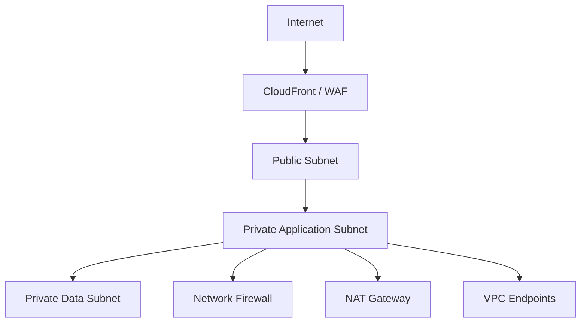

## Principles

- Minimize public exposure.
- Use private subnets for databases.
- Security groups should be application-specific.
- Avoid broad `0.0.0.0/0` inbound rules.
- Use VPC endpoints where they reduce internet exposure.
- Use centralized inspection where justified.
- Protect DNS.
- Monitor network paths.

Important nuance:

**Do not put every Lambda function in a VPC by default.**

VPC attachment should be driven by actual connectivity/security requirements. AWS notes that VPC-attached Lambda functions may need NAT gateways or VPC endpoints for service connectivity. [Lambda VPC guidance](https://docs.aws.amazon.com/lambda/latest/dg/configuration-vpc.html)

---

# 25. Security Metrics

Security leadership needs measurable outcomes.

## Identity

- % workforce access federated.
- % MFA coverage.
- Number of unused privileged roles.
- Number of wildcard permissions.
- Number of long-lived credentials.
- Number of external trust relationships.

## Vulnerability

- Critical vulnerabilities open.
- Mean time to remediate.
- Internet-facing critical findings.
- Vulnerability recurrence.

## Detection

- Mean time to detect.
- Mean time to acknowledge.
- Mean time to contain.
- False-positive rate.
- Detection coverage.

## Cloud posture

- Security Hub critical findings.
- GuardDuty high-severity findings.
- Public S3 exposure.
- Unencrypted resources.
- Security-group exposure.
- Logging coverage.

## DevSecOps

- % repositories with security scanning.
- % IaC scanned.
- % pipelines using OIDC.
- % production deployments with approval.
- Secret leakage incidents.

---

# 26. Security Operating Model

## Three lines of responsibility

```text
Engineering
  |
  | Own secure implementation
  v
Security
  |
  | Define guardrails, architecture, detection and assurance
  v
Risk / Compliance / Legal
  |
  | Regulatory interpretation and risk governance
  v
Leadership
  |
  | Risk acceptance / investment decisions
```

Security should not become the bottleneck for engineering. It should provide:

- Guardrails.
- Libraries.
- Templates.
- Automated controls.
- Reference architectures.
- Training.
- Threat modeling.
- Detection.
- Incident response.

---

# 27. 30 / 60 / 90-Day Plan

## First 30 days — Discover and stabilize

### Objectives

- Understand business.
- Understand AWS estate.
- Understand data.
- Identify critical risks.
- Establish security visibility.

### Actions

- AWS Organization review.
- IAM review.
- CloudTrail review.
- GuardDuty review.
- Security Hub review.
- Config review.
- Network review.
- Internet exposure review.
- S3 exposure review.
- Secrets review.
- CI/CD review.
- Vulnerability review.
- Incident-response review.
- Regulatory applicability workshop.

### Deliverables

```text
Current-state security architecture
Risk register
Top-10 remediation plan
AWS account/security baseline assessment
Data classification proposal
Incident-response gap assessment
Security roadmap
```

---

## Days 31–60 — Build foundations

### Objectives

- Reduce highest risks.
- Establish reusable security controls.

### Actions

- IAM remediation.
- Centralized logging.
- GuardDuty/Security Hub coverage.
- Critical Config controls.
- S3 baseline.
- KMS baseline.
- Secrets Manager baseline.
- Secure CI/CD baseline.
- IaC security scanning.
- Vulnerability-management workflow.
- Initial incident playbooks.
- Secure serverless reference architecture.

### Deliverables

```text
Secure AWS baseline
Golden-path serverless template
IAM standards
DevSecOps pipeline baseline
Security monitoring dashboard
Incident playbooks
```

---

## Days 61–90 — Scale and automate

### Objectives

- Move security from manual reviews to platform controls.

### Actions

- Organization guardrails.
- Automated account baseline.
- Automated finding remediation.
- Security-as-code.
- Threat modeling program.
- AI security framework.
- Security training.
- Purple-team exercises.
- Compliance evidence automation.
- Security metrics.

### Deliverables

```text
Security platform
Reference architectures
Automated controls
Detection catalogue
AI security policy
Security metrics
Quarterly security roadmap
```

---

# 28. Reference Tooling Stack

| Capability | AWS / Technology |
|---|---|
| Organization | AWS Organizations |
| Identity | IAM Identity Center + enterprise IdP |
| Authorization | IAM |
| Access analysis | IAM Access Analyzer |
| Guardrails | SCPs / organization controls |
| Audit | CloudTrail |
| Configuration | AWS Config |
| Threat detection | GuardDuty |
| Security findings | Security Hub |
| Investigation | Detective |
| Vulnerability | Inspector |
| Sensitive-data discovery | Macie |
| Secrets | Secrets Manager |
| Parameters | Systems Manager Parameter Store |
| Encryption | KMS |
| Network | VPC / Security Groups / Network Firewall |
| DNS security | Route 53 Resolver DNS Firewall |
| Web protection | AWS WAF |
| DDoS | Shield |
| API | API Gateway |
| Compute | Lambda |
| Messaging | SQS / SNS / EventBridge |
| Storage | S3 |
| NoSQL | DynamoDB |
| Relational | Aurora/RDS |
| Observability | CloudWatch |
| SIEM | Existing enterprise SIEM / approved AWS security analytics architecture |
| IaC | CDK / Terraform / CloudFormation |
| SAST | Approved SAST tool |
| SCA | Approved SCA tool |
| IaC scan | Checkov / tfsec or equivalent |
| Container scan | Trivy / Inspector / ECR scanning |
| Source control | GitHub or enterprise equivalent |
| AI | Approved enterprise AI gateway / model providers |

Tool selection should follow actual requirements, licensing and existing Org. platforms rather than adding tools simply because they exist.

---

# 29. What I Would Not Do

## Do not

### 1. Give developers AdministratorAccess

Solve the workflow problem with least-privilege roles and controlled elevation.

### 2. Put everything behind a VPC because "VPC is secure"

Serverless services have service-specific security models. Network isolation is only one layer.

### 3. Enable every security product without an operating model

A security tool without ownership, triage and remediation creates alert fatigue.

### 4. Treat Security Hub as the SIEM

Security Hub is a security posture/findings aggregation capability. A complete SIEM/SOC architecture may require broader log and detection analytics.

### 5. Treat GuardDuty as complete threat detection

GuardDuty is powerful but does not replace application-specific detections, identity monitoring, EDR or SIEM use cases.

### 6. Put secrets in Lambda environment variables without understanding the threat model

Use Secrets Manager for secrets that require secure lifecycle management and restrict access tightly.

### 7. Assume GDPR means encryption alone

GDPR is broader: purpose limitation, minimization, lawful processing, rights, retention, accountability, processors, transfers and breach obligations also matter.

### 8. Automatically claim HIPAA applies

Determine the legal/regulatory scope first.

### 9. Scan IaC but never block risky deployments

Security controls must connect to deployment decisions.

### 10. Let AI agents have unrestricted cloud credentials

Agentic systems require identity, tool authorization, policy enforcement, logging and human approval for high-risk operations.

---

# 30. How to Explain This Role in an Interview

A strong concise answer:

> "I would start by establishing the current security baseline across the AWS Organization, identity, network, data, workloads, CI/CD and detection capabilities. I would then map the business and regulatory requirements to concrete controls and build a multi-account security foundation with centralized logging, GuardDuty, Security Hub, Config and IAM guardrails. For applications, I would use secure serverless reference architectures with strong authentication, least-privilege execution roles, encryption, Secrets Manager, WAF and security-by-default IaC. I would embed SAST, SCA, secret scanning and IaC security into CI/CD using short-lived deployment identities. Finally, I would build detection and incident-response playbooks around identity compromise, data exposure, vulnerable workloads and application attacks, measure the controls continuously and automate remediation where safe."

---

# 31. Deep-Dive Example — Customer Order API

## Business requirement

Customer places an order through Org.'s web application.

## Security architecture

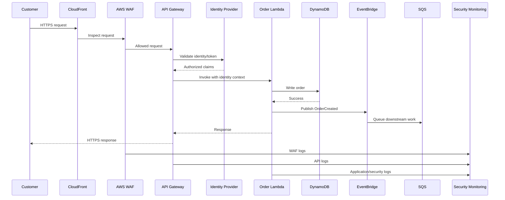

## Threats

- Account takeover.
- API abuse.
- Injection.
- Authorization bypass.
- Replay/duplicate requests.
- Data leakage.
- Credential compromise.
- Dependency compromise.
- Cloud IAM compromise.

## Controls

```text
CloudFront
  -> TLS

WAF
  -> managed rules
  -> rate limiting
  -> targeted application rules

API Gateway
  -> authentication
  -> authorization
  -> throttling
  -> request validation where appropriate

Lambda
  -> least-privilege execution role
  -> input validation
  -> dependency security
  -> no secrets in source

DynamoDB
  -> encryption
  -> IAM access
  -> least privilege

EventBridge/SQS
  -> resource policies
  -> encryption
  -> least privilege

CloudTrail
  -> audit API activity

GuardDuty/Security Hub
  -> threat detection/posture

CI/CD
  -> SAST/SCA/secrets/IaC checks
```

---

# 32. Deep-Dive Example — Security Incident

## Scenario

A Lambda execution role is suspected of being abused.

### Detection

GuardDuty reports suspicious API activity.

### Investigation

```text
GuardDuty finding
      |
      v
Security Hub
      |
      v
EventBridge
      |
      v
Incident workflow
      |
      +--> Identify IAM principal
      +--> CloudTrail timeline
      +--> Source IP
      +--> API calls
      +--> Resources accessed
      +--> Data access
      +--> Persistence
```

### Containment

1. Determine whether the role is actively being abused.
2. Revoke/limit compromised credentials or sessions as appropriate.
3. Temporarily restrict the role if business impact permits.
4. Preserve evidence.
5. Rotate related secrets.
6. Block malicious indicators where appropriate.

### Recovery

1. Remove unauthorized policy changes.
2. Patch root cause.
3. Deploy clean configuration.
4. Validate IAM trust relationships.
5. Validate CloudTrail/logging.
6. Monitor.

### Post-incident

Ask:

- Why did the attacker obtain access?
- Why did the role have that permission?
- Why did detection trigger or fail?
- Could blast radius have been smaller?
- Which guardrail should prevent recurrence?

---

# 33. Security Architecture Review Checklist

## AWS Organization

- [ ] Multi-account boundary strategy defined.
- [ ] Production isolated.
- [ ] Security account separated.
- [ ] Log archive protected.
- [ ] Organization guardrails defined.
- [ ] Root accounts protected.

## IAM

- [ ] Workforce federation.
- [ ] MFA.
- [ ] Least privilege.
- [ ] Temporary credentials.
- [ ] No unnecessary long-lived keys.
- [ ] Cross-account trust reviewed.
- [ ] IAM Access Analyzer enabled.
- [ ] Privileged access reviewed.

## Network

- [ ] Public exposure documented.
- [ ] Private data tier.
- [ ] Security groups least privilege.
- [ ] WAF where appropriate.
- [ ] DNS protection where required.
- [ ] VPC endpoints evaluated.
- [ ] Network telemetry available.

## Data

- [ ] Classification.
- [ ] Encryption.
- [ ] KMS ownership.
- [ ] Secrets Manager.
- [ ] Retention.
- [ ] Deletion.
- [ ] Backup/recovery.
- [ ] Sensitive-data discovery.

## Serverless

- [ ] API authentication.
- [ ] API authorization.
- [ ] WAF.
- [ ] Lambda least privilege.
- [ ] Resource-based policies reviewed.
- [ ] No embedded secrets.
- [ ] Logging without sensitive data.
- [ ] Dependency scanning.

## DevSecOps

- [ ] Branch protection.
- [ ] SAST.
- [ ] SCA.
- [ ] Secret scanning.
- [ ] IaC scanning.
- [ ] SBOM.
- [ ] Artifact integrity.
- [ ] OIDC.
- [ ] Deployment separation.
- [ ] Production approval.

## Detection

- [ ] CloudTrail.
- [ ] GuardDuty.
- [ ] Security Hub.
- [ ] Config.
- [ ] Application logs.
- [ ] WAF logs.
- [ ] SIEM integration.
- [ ] Actionable detections.

## Incident response

- [ ] IR plan.
- [ ] Severity model.
- [ ] Contact/escalation model.
- [ ] IAM compromise playbook.
- [ ] Data breach playbook.
- [ ] Secret exposure playbook.
- [ ] Cloud compromise playbook.
- [ ] Regular exercises.

## Governance

- [ ] Data classification.
- [ ] Threat modeling.
- [ ] Privacy-by-design.
- [ ] Regulatory applicability.
- [ ] Evidence collection.
- [ ] Risk register.
- [ ] Security metrics.

## AI

- [ ] Approved AI tools.
- [ ] Data classification rules.
- [ ] No secrets in prompts.
- [ ] Agent identity.
- [ ] Tool authorization.
- [ ] Audit logging.
- [ ] Human approval for high-risk operations.
- [ ] AI incident process.

---

# 34. Final Architecture Principle

The target security architecture should not be:

```text
Buy security tools
      ↓
Install security tools
      ↓
Generate alerts
      ↓
Security team investigates everything
```

It should be:

```text
Business requirement
      ↓
Risk
      ↓
Security architecture
      ↓
Preventive control
      ↓
Automated validation
      ↓
Detection
      ↓
Automated / human response
      ↓
Evidence
      ↓
Metrics
      ↓
Continuous improvement
```

The Senior Security Engineer should become the **security engineering multiplier** for the organization:

```text
Security expertise
       +
AWS platform engineering
       +
Developer enablement
       +
Automation
       +
Detection/response
       +
Privacy/compliance
       +
AI security
       =
Scalable security
```

---

# 35. Primary Official References

The following are the primary sources I would use when implementing this plan:

1. AWS Security Reference Architecture — multi-account security foundation.
2. AWS Well-Architected Security Pillar — security principles and workload controls.
3. AWS IAM least-privilege guidance.
4. AWS GuardDuty documentation.
5. AWS Security Hub documentation.
6. AWS CloudTrail documentation.
7. AWS Lambda security documentation.
8. AWS API Gateway security documentation.
9. AWS CodePipeline/CodeBuild security documentation.
10. AWS HIPAA eligibility documentation where HIPAA is actually applicable.
11. AWS compliance documentation and AWS Artifact for applicable third-party assurance evidence.

AWS's Security Reference Architecture is a living reference and was updated in June 2026; it should be checked again before implementing controls because AWS services and recommendations evolve. [AWS SRA document history](https://docs.aws.amazon.com/prescriptive-guidance/latest/security-reference-architecture/doc-history.html)

---

# 36. Recommended First Technical Deliverable at Org.

If I joined and needed to demonstrate value quickly, I would propose building:

## "Org. AWS Security Baseline + Secure Serverless Golden Path"

It would contain:

```text
01-organization/
02-iam/
03-network/
04-logging/
05-guardduty/
06-security-hub/
07-config/
08-kms/
09-secrets/
10-s3/
11-serverless/
12-api-gateway/
13-devsecops/
14-vulnerability-management/
15-incident-response/
16-ai-security/
17-compliance/
18-security-metrics/
```

And provide:

```text
Terraform/CDK modules
+
Security policies
+
CI/CD workflows
+
Threat-model templates
+
Incident playbooks
+
Security dashboards
+
Architecture diagrams
+
Developer guidance
+
Compliance evidence mapping
```

This directly maps the job description to tangible engineering outcomes rather than only policy documents.

---

# 37. Bottom Line

For this Org. role, the strongest technical strategy is to combine:

**AWS Security Reference Architecture + least-privilege IAM + secure serverless patterns + data protection + DevSecOps + centralized detection + incident response + privacy-by-design + AI governance.**

The key is not knowing the names of AWS security services. The senior-level expectation is being able to explain:

**Why the control exists → where it belongs → how to implement it → how to test it → how to operate it → how to measure it → what happens when it fails.**

That is the mindset I would use when owning Org.'s security engineering function.
