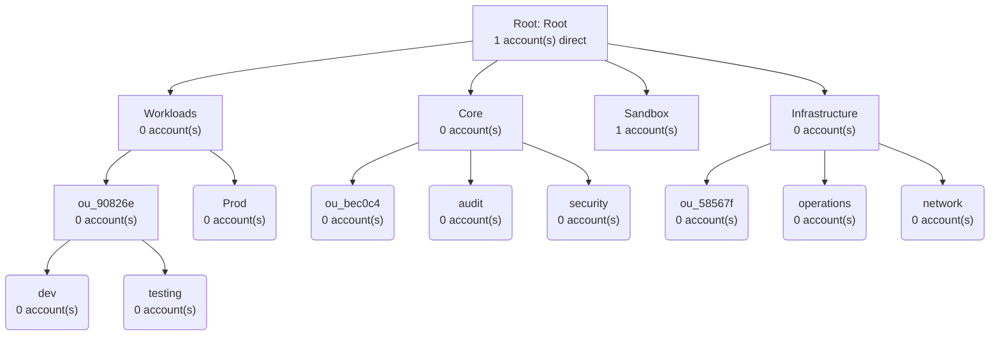

# AWS security assessment — acct_78e004

| | |
|---|---|
| Generated | 2026-08-15T11:20:57Z |
| Account | `acct_78e004` |
| Assessing principal | `arn:aws:sts::acct_78e004:assumed-role/role_8cb8f5/botocore-session-1786791392` |
| Regions scanned | 2 — us-east-1, eu-north-1 |
| Collectors | 21 |
| AWS API calls | 311 (8 absent, 1 denied, 301 ok, 1 unsupported) |
| Duration | 33.0s |

## Scope and limits

Every call made by this assessment is a `Describe*` / `List*` / `Get*` control-plane operation. No object, secret value, parameter value or table row was read; a runtime guard refuses those operations before they reach AWS. The full call log is in the snapshot this report was rendered from.

**The assessing identity is over-privileged for its own task.** This ran as `arn:aws:sts::acct_78e004:assumed-role/role_8cb8f5/botocore-session-1786791392`, an administrator. The read-only policy in `platform/00-discovery/iam/discovery-readonly.json` is what it *should* run under, and until it has, that policy is unproven — it may be missing permissions, or granting more than it needs. Re-running under a purpose-built role is the test.

**1 API call(s) were denied** and the corresponding controls could not be assessed: macie2:get_macie_session. These are reported as `not-permitted`, never as absent.

Regional services were assessed in **2 region(s)**. Findings say nothing about regions outside that set — and an unmonitored region is where an attacker would prefer to operate.

## Summary

| Severity | Count | Remediate within |
|---|---:|---|
| 🔴 Critical | 1 | 7 days |
| 🟠 High | 10 | 30 days |
| 🟡 Medium | 15 | 90 days |
| ⚪ Low | 3 | 180 days |
| **Total** | **29** | |

Findings by domain: **identity** 14, **logging** 6, **code** 5, **infrastructure** 3, **data** 1

## Top risks

Ordered by severity, which here is assigned from exposure, blast radius and data sensitivity rather than from a scoring formula.

| # | Finding | Severity | Domain |
|---:|---|---|---|
| 1 | [IAM-004](#iam-004) Compute execution role carries administrator access | 🔴 Critical | identity |
| 2 | [APP-001](#app-001) API stages without an authorizer | 🟠 High | code |
| 3 | [DET-005](#det-005) No external-access IAM Access Analyzer | 🟠 High | identity |
| 4 | [IAM-001](#iam-001) Administrator access attached directly to an IAM user | 🟠 High | identity |
| 5 | [IAM-002](#iam-002) Active long-lived access keys | 🟠 High | identity |
| 6 | [IAM-005](#iam-005) Federated CI/CD or SSO role grants administrator access | 🟠 High | identity |
| 7 | [IAM-006](#iam-006) Root MFA is absent or software-based | 🟠 High | identity |
| 8 | [LOG-004](#log-004) AWS Config is not recording | 🟠 High | logging |
| 9 | [NET-003](#net-003) Security groups open to the internet | 🟠 High | infrastructure |
| 10 | [ORG-001](#org-001) Security services have no delegated administrator | 🟠 High | identity |

## Organization as observed

Organization `org_f233fe`, feature set ALL, 2 account(s).

| Account | Name | Management | Status |
|---|---|---|---|
| `acct_78e004` | account_523b47 | yes | ACTIVE |
| `acct_1e3fc5` | account_d0013f |  | ACTIVE |

Policy types enabled: BEDROCK_POLICY, RESOURCE_CONTROL_POLICY, S3_POLICY, SERVICE_CONTROL_POLICY, TAG_POLICY. Disabled: AISERVICES_OPT_OUT_POLICY, BACKUP_POLICY, CHATBOT_POLICY, DECLARATIVE_POLICY_EC2.

## Baseline checklist coverage

The 25-point current-state baseline from `docs/aws_security_engineering_plan.md` §3. Every item has a status: nothing is left blank, because a blank row and a passing row look identical.

| # | Item | Status | Source | Findings |
|---:|---|---|---|---|
| 1 | Inventory AWS Organizations and accounts | `observed` | AWS API | — |
| 2 | Identify production vs non-production accounts | `observed` | AWS API | — |
| 3 | Inventory internet-facing assets | `observed` | AWS API | — |
| 4 | Inventory IAM identities, roles and trust policies | `observed` | AWS API | IAM-004, DET-005, IAM-001, IAM-002, IAM-005, DET-006, IAM-003 |
| 5 | Review root-account controls | `observed` | AWS API | IAM-006, ORG-003 |
| 6 | Review IAM Identity Center / enterprise IdP integration | `observed` | AWS API | IAM-008, IAM-009 |
| 7 | Review SCPs and organization policies | `observed` | AWS API | ORG-001, ORG-003, ORG-002, ORG-004 |
| 8 | Review CloudTrail coverage | `observed` | AWS API | LOG-002, LOG-003 |
| 9 | Review GuardDuty coverage | `observed` | AWS API | DET-002 |
| 10 | Review Security Hub coverage | `observed` | AWS API | DET-003, DET-004 |
| 11 | Review AWS Config coverage | `observed` | AWS API | LOG-004 |
| 12 | Review encryption/KMS architecture | `observed` | AWS API | DAT-003, LOG-002 |
| 13 | Review S3 public-access configuration | `observed` | AWS API | — |
| 14 | Review VPC topology | `observed` | AWS API | NET-001, NET-002 |
| 15 | Review security groups and network paths | `observed` | AWS API | NET-003 |
| 16 | Review Lambda/API Gateway architecture | `observed` | AWS API | IAM-004, APP-001, APP-002 |
| 17 | Review secrets management | `observed` | AWS API | — |
| 18 | Review CI/CD pipelines | `observed` | repository | IAM-005, CI-001, CI-002, CI-003 |
| 19 | Review Terraform/CDK/CloudFormation repositories | `observed` | repository | — |
| 20 | Review vulnerability-management process | `observed` | AWS API | CI-003 |
| 21 | Review incident-response procedures | `judgement` | docs/05-incident-response/ | — |
| 22 | Review third-party integrations | `observed` | AWS API | DET-005 |
| 23 | Map important data flows | `judgement` | docs/01-threat-model.md | — |
| 24 | Identify regulatory and contractual obligations | `judgement` | docs/06-compliance-map.md | — |
| 25 | Establish the top 10 security risks | `judgement` | this report | — |

## Findings

### IAM-004

**Compute execution role carries administrator access** — 🔴 Critical · identity · checklist 4, 16

Compute execution role(s) carry administrator access: role_fb4f01. Any code that runs under them — including a dependency compromised upstream — has the whole account.

**Remediation.** Replace the managed policy with an enumerated, resource-scoped policy for exactly what the function calls.

### APP-001

**API stages without an authorizer** — 🟠 High · code · checklist 16

2 API stage(s) have no authorizer attached: api_3f2806/$default, api_3f2806/api-deploy-stage. Authorization is then entirely the function's responsibility, with nothing in front of it to fail closed.

**Remediation.** Attach a JWT, Cognito or IAM authorizer at the API layer so unauthenticated requests never reach the function.

### DET-005

**No external-access IAM Access Analyzer** — 🟠 High · identity · checklist 4, 22

Only an unused-access analyzer is configured. The external-access analyzer — the one that finds resources reachable from outside the account or organization — is not enabled anywhere.

**Remediation.** Create an organization-scoped external-access analyzer; it is the control that finds resources shared outside the organization.

### IAM-001

**Administrator access attached directly to an IAM user** — 🟠 High · identity · checklist 4

Administrator-grade policies are attached directly to IAM user(s): user_8e2e61. A user carries no session limit, no permission boundary, and no central revocation path.

**Remediation.** Move the access to a role assumed through IAM Identity Center, with a permissions boundary and a short session duration.

References: <https://docs.aws.amazon.com/wellarchitected/latest/security-pillar/sec_permissions_least_privileges.html>

### IAM-002

**Active long-lived access keys** — 🟠 High · identity · checklist 4

1 active long-lived access key(s) exist: user_8e2e61 (2d). A static key is a credential that cannot expire and does not appear in a session log. 1 of these belong to an administrator: user_8e2e61 (2d).

**Remediation.** Replace with short-lived credentials from Identity Center or OIDC federation, then delete the key. Deactivate before deleting so CloudTrail correlation survives.

### IAM-005

**Federated CI/CD or SSO role grants administrator access** — 🟠 High · identity · checklist 4, 18

Federated (CI/CD or SSO) role(s) grant administrator access: role_73faa0, role_0a8ff5. A pipeline with organization-wide admin turns any repository compromise into an account compromise.

**Remediation.** Split into plan and apply roles, scope the OIDC trust to specific repository, branch and environment claims, and gate production behind an approval.

### IAM-006

**Root MFA is absent or software-based** — 🟠 High · identity · checklist 5

Root MFA is a virtual (software) device. For the one identity that can undo every other control, a phishing-resistant hardware key is the appropriate control.

**Remediation.** Register a phishing-resistant hardware security key for root and store it under dual control.

### LOG-004

**AWS Config is not recording** — 🟠 High · logging · checklist 11

AWS Config is not recording in 2 of 2 scanned regions (eu-north-1, us-east-1). Rules are defined where nothing is recorded, so they evaluate nothing: eu-north-1 (343 rules defined).

**Remediation.** Enable the configuration recorder in every region in scope, including global resource types, before relying on any Config rule or conformance pack.

### NET-003

**Security groups open to the internet** — 🟠 High · infrastructure · checklist 15

1 security group(s) allow ingress from 0.0.0.0/0: sg_c675cf. Confirm each is intended to be public.

**Remediation.** Restrict ingress to the specific source security group or prefix list. Where public access is intended, front it with a load balancer or CloudFront and WAF.

### ORG-001

**Security services have no delegated administrator** — 🟠 High · identity · checklist 7

8 security services have no delegated administrator, so each is administered from the management account: access-analyzer.amazonaws.com, auditmanager.amazonaws.com, config.amazonaws.com, detective.amazonaws.com, guardduty.amazonaws.com (+3 more)

**Remediation.** Delegate GuardDuty, Security Hub, Config, Access Analyzer, Inspector, Macie and Detective administration to a dedicated security-tooling account.

References: <https://docs.aws.amazon.com/prescriptive-guidance/latest/security-reference-architecture/organizations.html>

### ORG-003

**Root-attached SCPs do not constrain the management account** — 🟠 High · identity · checklist 5, 7

4 service control policies are attached at the organization root (scp_cd17f1, scp_bd397c, scp_4aad35, scp_ed4250). SCPs never apply to the management account, so none of these constrain it — the account with the most privilege in the organization is the one they do not reach.

**Remediation.** Move workloads out of the management account, keep it for organization administration only, and rely on controls that do apply to it: hardware MFA on root, centralised root credential management, and CloudTrail.

References: <https://docs.aws.amazon.com/prescriptive-guidance/latest/security-reference-architecture/management-account.html>

### APP-002

**API stages without access logging** — 🟡 Medium · code · checklist 16

1 API stage(s) have no access logging: api_3f2806/api-deploy-stage

**Remediation.** Enable access logging to CloudWatch Logs with a structured format including identity, source IP and status.

### CI-001

**No AWS OIDC federation in CI** — 🟡 Medium · code · checklist 18

No GitHub Actions workflow authenticates to AWS via OIDC. Any deployment therefore depends on a stored credential, which is the artefact OIDC exists to remove.

**Remediation.** Wire the existing github-oidc Terraform module into the workflows and remove any stored AWS credential.

### CI-002

**GitHub Actions not pinned to commit SHAs** — 🟡 Medium · code · checklist 18

9 GitHub Action reference(s) are not pinned to a commit SHA: actions/checkout@v4, actions/setup-node@v4, anchore/sbom-action@v0, astral-sh/setup-uv@v5, bridgecrewio/checkov-action@master (+4 more). A tag can be moved to point at different code after review.

**Remediation.** Pin every third-party action to a full commit SHA and let Dependabot raise updates.

### DAT-003

**No customer-managed KMS keys** — 🟡 Medium · data · checklist 12

No customer-managed KMS keys exist; everything encrypted relies on AWS-managed keys. Those cannot carry a key policy, so encryption cannot be used as an access control boundary and key usage cannot be restricted per workload.

**Remediation.** Introduce customer-managed keys for sensitive data stores so encryption can carry a key policy and act as an access boundary.

### DET-002

**GuardDuty protection plans disabled and uneven across regions** — 🟡 Medium · logging · checklist 9

GuardDuty is enabled but with protection plans switched off, unevenly across regions — us-east-1: AI_ANALYST, AI_PROTECTION, EBS_MALWARE_PROTECTION, EKS_AUDIT_LOGS (+5 more); eu-north-1: AI_ANALYST, AI_PROTECTION, EKS_RUNTIME_MONITORING, RUNTIME_MONITORING. Coverage that differs by region is coverage nobody can reason about.

**Remediation.** Enable the same protection plans in every region, or record a written decision for each exclusion.

### DET-003

**Security Hub standards are not READY** — 🟡 Medium · logging · checklist 10

Security Hub standards are not in a READY state: us-east-1: cis-aws-foundations-benchmark, us-east-1: aws-foundational-security-best-practices. Controls that have not finished initialising are not evaluating anything.

**Remediation.** Investigate why initialisation has not completed; a standard that is not READY is evaluating nothing.

### DET-006

**IAM Access Analyzer missing in some regions** — 🟡 Medium · identity · checklist 4

IAM Access Analyzer is absent in 1 scanned region(s): eu-north-1.

**Remediation.** Create an analyzer in every region in scope; findings are regional.

### IAM-003

**No role has a permissions boundary** — 🟡 Medium · identity · checklist 4

None of the 14 customer-managed roles has a permissions boundary. A boundary is the only IAM control that survives someone attaching a wider policy later.

**Remediation.** Define a boundary policy and require it on role creation, enforced by SCP condition and by the CDK aspect in platform/lib/cdk-security.

### IAM-008

**Administrator permission sets have no permissions boundary** — 🟡 Medium · identity · checklist 6

2 administrator permission set(s) have no permissions boundary: PowerUserAccess (PT1H), AdministratorAccess (PT12H). Session duration is the only limit on how long that access lasts.

**Remediation.** Attach a boundary to every admin permission set so its effective privilege cannot be widened by a later policy change.

### IAM-009

**Administrator sessions last longer than four hours** — 🟡 Medium · identity · checklist 6

Administrator permission set(s) issue sessions longer than four hours: AdministratorAccess (PT12H). A stolen session token stays valid for that long.

**Remediation.** Reduce admin permission-set session duration to one hour; re-authentication is cheap and a stolen token's useful life is the whole risk.

### LOG-002

**CloudTrail logs are not encrypted with a customer-managed key** — 🟡 Medium · logging · checklist 8, 12

CloudTrail log files are not encrypted with a customer-managed key: trail_69b599. Anyone with read access to the destination bucket can read the full audit history.

**Remediation.** Encrypt the trail with a KMS key whose policy restricts decryption to the security and audit roles.

### LOG-003

**No CloudTrail data events configured** — 🟡 Medium · logging · checklist 8

No trail records data events: trail_69b599. Management events show that a role was assumed; data events show which objects it then read. Only the second answers 'what was taken' during an incident.

**Remediation.** Enable data events selectively for buckets and functions holding sensitive data, where the volume and cost are justified.

### NET-001

**VPCs without flow logs** — 🟡 Medium · infrastructure · checklist 14

2 VPC(s) have no flow logs: us-east-1/vpc_6672fb, eu-north-1/vpc_b36013. Network-level evidence does not exist retroactively — it is either being recorded now or it is not available during the incident.

**Remediation.** Enable flow logs to a central destination for every VPC carrying workload traffic.

### ORG-002

**SCPs attached only to empty organizational units** — 🟡 Medium · identity · checklist 7

3 service control policies are attached only to organizational units that contain no accounts, so they constrain nothing: scp_358d7f → Workloads, scp_9e797a → Prod, scp_8b115f → Workloads

**Remediation.** Move accounts into the OUs the policies target, or attach the policies where the accounts actually are. Verify with DescribeEffectivePolicy.

### ORG-004

**Resource control policies enabled but unused** — 🟡 Medium · identity · checklist 7

Resource control policies are enabled but none are defined. Only the AWS-managed RCPFullAWSAccess is attached, so no organization-wide limit exists on who may be granted access to resources by a resource policy.

**Remediation.** Define RCPs restricting S3, KMS, STS and SQS resource policies to trusted organization principals, closing the confused-deputy path SCPs cannot reach.

### CI-003

**No Dependabot configuration** — ⚪ Low · code · checklist 18, 20

No Dependabot configuration is present, so dependency and action updates are not raised automatically.

**Remediation.** Add .github/dependabot.yml covering pip, npm, terraform and github-actions.

### DET-004

**Outdated CIS benchmark version enabled** — ⚪ Low · logging · checklist 10

An outdated CIS AWS Foundations Benchmark version is enabled: us-east-1: CIS 1.2.0, eu-north-1: CIS 1.2.0. Later versions add controls for services that did not exist when 1.2 was written.

**Remediation.** Enable CIS AWS Foundations Benchmark v3.0 or later alongside AWS FSBP.

### NET-002

**Default VPCs present** — ⚪ Low · infrastructure · checklist 14

2 default VPC(s) are present: us-east-1/vpc_6672fb, eu-north-1/vpc_b36013. A default VPC ships with an internet gateway, public subnets and a permissive default security group in every region, whether or not anyone intends to use it.

**Remediation.** Delete unused default VPCs, or record why they are retained. Enforce with a Config rule so they do not reappear in a newly enabled region.

## Risk register

In the shape of `docs/aws_security_engineering_plan.md` §3 Step 2. Treatment is the proposed action; ownership and acceptance are decisions for the risk owner, not for this tool.

| ID | Risk | Severity | SLA | Treatment |
|---|---|---|---:|---|
| IAM-004 | Compute execution role carries administrator access | 🔴 Critical | 7d | Replace the managed policy with an enumerated, resource-scoped policy for exactly what the function calls |
| APP-001 | API stages without an authorizer | 🟠 High | 30d | Attach a JWT, Cognito or IAM authorizer at the API layer so unauthenticated requests never reach the function |
| DET-005 | No external-access IAM Access Analyzer | 🟠 High | 30d | Create an organization-scoped external-access analyzer; it is the control that finds resources shared outside the organization |
| IAM-001 | Administrator access attached directly to an IAM user | 🟠 High | 30d | Move the access to a role assumed through IAM Identity Center, with a permissions boundary and a short session duration |
| IAM-002 | Active long-lived access keys | 🟠 High | 30d | Replace with short-lived credentials from Identity Center or OIDC federation, then delete the key |
| IAM-005 | Federated CI/CD or SSO role grants administrator access | 🟠 High | 30d | Split into plan and apply roles, scope the OIDC trust to specific repository, branch and environment claims, and gate production behind an approval |
| IAM-006 | Root MFA is absent or software-based | 🟠 High | 30d | Register a phishing-resistant hardware security key for root and store it under dual control |
| LOG-004 | AWS Config is not recording | 🟠 High | 30d | Enable the configuration recorder in every region in scope, including global resource types, before relying on any Config rule or conformance pack |
| NET-003 | Security groups open to the internet | 🟠 High | 30d | Restrict ingress to the specific source security group or prefix list |
| ORG-001 | Security services have no delegated administrator | 🟠 High | 30d | Delegate GuardDuty, Security Hub, Config, Access Analyzer, Inspector, Macie and Detective administration to a dedicated security-tooling account |
| ORG-003 | Root-attached SCPs do not constrain the management account | 🟠 High | 30d | Move workloads out of the management account, keep it for organization administration only, and rely on controls that do apply to it: hardware MFA on root, centralised root credential management, and CloudTrail |
| APP-002 | API stages without access logging | 🟡 Medium | 90d | Enable access logging to CloudWatch Logs with a structured format including identity, source IP and status |
| CI-001 | No AWS OIDC federation in CI | 🟡 Medium | 90d | Wire the existing github-oidc Terraform module into the workflows and remove any stored AWS credential |
| CI-002 | GitHub Actions not pinned to commit SHAs | 🟡 Medium | 90d | Pin every third-party action to a full commit SHA and let Dependabot raise updates |
| DAT-003 | No customer-managed KMS keys | 🟡 Medium | 90d | Introduce customer-managed keys for sensitive data stores so encryption can carry a key policy and act as an access boundary |
| DET-002 | GuardDuty protection plans disabled and uneven across regions | 🟡 Medium | 90d | Enable the same protection plans in every region, or record a written decision for each exclusion |
| DET-003 | Security Hub standards are not READY | 🟡 Medium | 90d | Investigate why initialisation has not completed; a standard that is not READY is evaluating nothing |
| DET-006 | IAM Access Analyzer missing in some regions | 🟡 Medium | 90d | Create an analyzer in every region in scope; findings are regional |
| IAM-003 | No role has a permissions boundary | 🟡 Medium | 90d | Define a boundary policy and require it on role creation, enforced by SCP condition and by the CDK aspect in platform/lib/cdk-security |
| IAM-008 | Administrator permission sets have no permissions boundary | 🟡 Medium | 90d | Attach a boundary to every admin permission set so its effective privilege cannot be widened by a later policy change |
| IAM-009 | Administrator sessions last longer than four hours | 🟡 Medium | 90d | Reduce admin permission-set session duration to one hour; re-authentication is cheap and a stolen token's useful life is the whole risk |
| LOG-002 | CloudTrail logs are not encrypted with a customer-managed key | 🟡 Medium | 90d | Encrypt the trail with a KMS key whose policy restricts decryption to the security and audit roles |
| LOG-003 | No CloudTrail data events configured | 🟡 Medium | 90d | Enable data events selectively for buckets and functions holding sensitive data, where the volume and cost are justified |
| NET-001 | VPCs without flow logs | 🟡 Medium | 90d | Enable flow logs to a central destination for every VPC carrying workload traffic |
| ORG-002 | SCPs attached only to empty organizational units | 🟡 Medium | 90d | Move accounts into the OUs the policies target, or attach the policies where the accounts actually are |
| ORG-004 | Resource control policies enabled but unused | 🟡 Medium | 90d | Define RCPs restricting S3, KMS, STS and SQS resource policies to trusted organization principals, closing the confused-deputy path SCPs cannot reach |
| CI-003 | No Dependabot configuration | ⚪ Low | 180d | Add  |
| DET-004 | Outdated CIS benchmark version enabled | ⚪ Low | 180d | Enable CIS AWS Foundations Benchmark v3 |
| NET-002 | Default VPCs present | ⚪ Low | 180d | Delete unused default VPCs, or record why they are retained |

## Assessment coverage

| Collector | Domain | Status | Note |
|---|---|---|---|
| access_analyzer | identity | `observed` |  |
| api_gateway | code | `observed` |  |
| cicd | code | `observed` | Sourced from the repository, not from AWS |
| cloudtrail | logging | `observed` |  |
| config | logging | `observed` |  |
| exposure | infrastructure | `observed` |  |
| guardduty | logging | `observed` |  |
| iac | code | `observed` | Sourced from the repository, not from AWS |
| iam | identity | `observed` |  |
| identity_center | identity | `observed` |  |
| kms | data | `observed` |  |
| lambda | code | `observed` |  |
| organizations | identity | `observed` |  |
| root_controls | identity | `observed` |  |
| s3 | data | `observed` |  |
| secrets | data | `observed` |  |
| security_groups | infrastructure | `observed` |  |
| securityhub | logging | `observed` |  |
| third_party | identity | `observed` |  |
| vpc | infrastructure | `observed` |  |
| vulnerability_services | code | `observed` |  |
